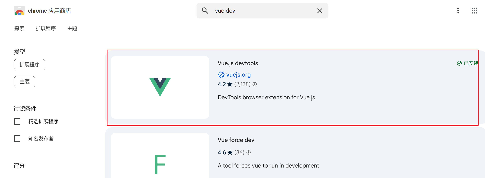
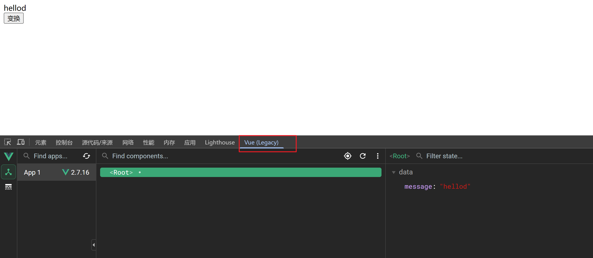
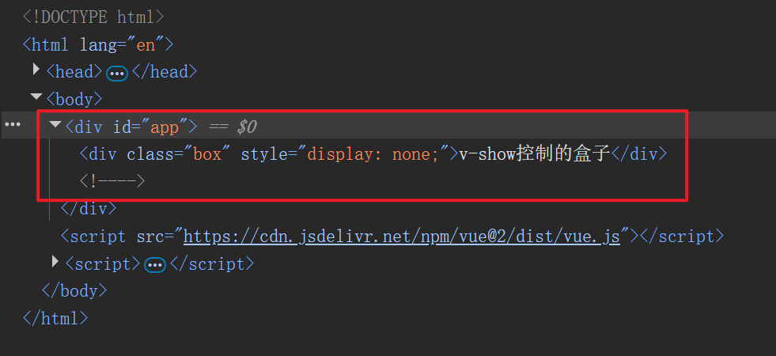
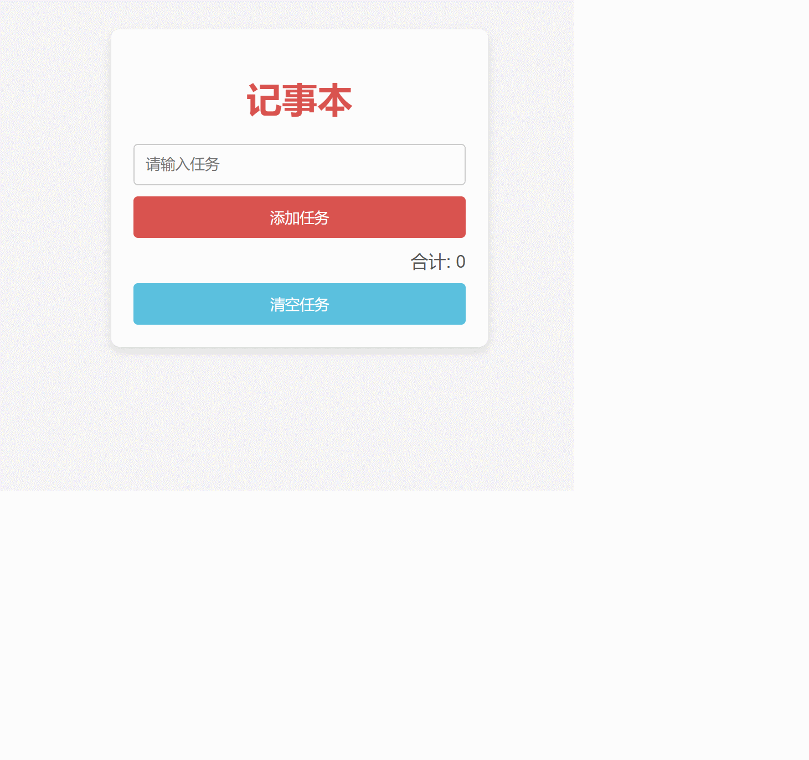

---

---

# Vue快速入门

## vue基本概念

[vue](https://cn.vuejs.org/)是一个用于构建用户界面的渐进式`JavaScript`框架

### 创建Vue实例并初始化渲染

1. 准备容器，即Vue所管理的元素范围
2. 引包，可以从官方文档找到引用的链接地址（开发版本/生产版本）
3. 创建实例
4. 添加配置，完成渲染

```html
<body>
    <!--准备容器-->
    <div id="app">
        <!--这里会编写用于渲染的代码逻辑-->
        {{message}}
    </div>
    <!--导包-->
    <script src="https://cdn.jsdelivr.net/npm/vue@2.7.16/dist/vue.js"></script>
    <script>
        //实例化对象
        let app = new Vue({
            el:"#app",//通过el配置选择器，指定挂载点，即Vue管理的元素范围
            data:{ //data提供渲染的数据
                message:"hello world!!!"
            }
        })
    </script>
</body>
```


### 插值表达式

插值表达式`{{表达式}}`是一种`Vue`的模板语法，利用表达式进行插值，可以把对应的数据渲染到页面，这里面的表达式可以是被求值的代码，`JS`引擎会将其进行算法得出结果

使用插值表达式应注意的点：

- 使用的数据必须存在，在`vue`对象的`data`中能够找的到
- 只支持表达式，而非语句，比如`if`、`for`等不支持
- 不能在标签的属性中使用插值表达式，一般是用于标签的文本位置用于展示

```html
<body>
    <div id="app">
        <p>{{userName}}</p>
        <p>{{userName.toUpperCase()}}</p>
        <p>{{age>=18?"成年":"未成年"}}</p>
        <p>{{student.name}}</p>
        <p>{{student.age}}</p>
    </div>
    <script src="https://cdn.jsdelivr.net/npm/vue@2/dist/vue.js"></script>
    <script>
        const app = new Vue({
            el:"#app",
            data:{
                userName:"bob",
                age:18,
                student:{
                    name:"李白",
                    age:27
                }
            }
        })
    </script>
</body>
```


### Vue核心特性：响应式

响应式：数据发生变化，视图自动更新

本质上是数据改变，vue底层会监听到数据修改，然后进行相关的dom操作，来自动更新视图

- 访问数据里面的属性值：对象.属性名

- 修改数据：对象.属性名=新值

```html
<body>
  <div id="app">
    {{message}}
  </div>
  <button id="change" onclick="change()">变换</button>
  <script src="https://cdn.jsdelivr.net/npm/vue@2/dist/vue.js"></script>
  <script>
    const app = new Vue({
      el: "#app",
      data: {
        message: "hello word"
      }
    })
    function change() {
      //改变message的值
      app.message = "we are family"
    }
  </script>
</body>
```


### Vue开发者工具

[Vue DevTools](https://devtools.vuejs.org/) 是一个插件，能够方便开发者调试Vue应用

安装：通过谷歌应用商店安装（国内可以在 [极简插件](https://chrome.zzzmh.cn/index)上下载）



安装之后在浏览器页面右击检查，可以看到对用选项



## vue指令

`Vue`会根据不同的指令，针对标签实现不同的功能

指令：带有`v-`前缀的特殊标签属性

常见的指令参照[官方文档](https://v2.cn.vuejs.org/v2/api/#%E6%8C%87%E4%BB%A4)

### v-html

相当于`innerHtml`能够对表达式进行解析

```html
<body>
  <div id="app">
    <div v-html="msg"></div>
  </div>
  <script src="https://cdn.jsdelivr.net/npm/vue@2/dist/vue.js"></script>
  <script>
    const app = new Vue({
      el: "#app",
      data: {
        msg: `
        <a href="https://www.baidu.com">百度</>
        `
      }
    })
  </script>
</body>
```

### v-show

功能：根据表达式真假，控制元素的显示与隐藏

语法：`v-show="表达式"`，表达式值为`true`显示，`false`隐藏

### v-if

功能：根据表达式真假，控制元素的显示与隐藏（条件渲染）

语法：`v-if="表达式"`，表达式值为`true`显示，`false`隐藏

**v-show & v-if的区别**

`v-show`是通过`display`属性来控制元素的显示与隐藏，而`v-if`是通过条件渲染来实现的

当表达式值为`false`时，两者都会使元素不显示，但是存在区别：

- `v-show`此时是通过`display=none`来不显示元素
- `v-if`此时通过移除元素来实现隐藏

所以`v-show`适用于频繁切换隐藏的场景，因为`v-if`会根据表达式值不断创建和销毁元素，更加耗费性能

不频繁切换的场景建议使用`v-if`

```html
<body>
  <div id="app">
    <div class="box" v-show="flag">v-show控制的盒子</div>
    <div class="box" v-if="flag">v-if控制的盒子</div>
  </div>
  <script src="https://cdn.jsdelivr.net/npm/vue@2/dist/vue.js"></script>
  <script>
    const app = new Vue({
      el: "#app",
      data: {
        flag: false
      }
    })
  </script>
</body>
```



### v-else和v-else-if

两者是辅助`v-if`来进行条件渲染，适用于多条件判断场景

```html
<body>
  <div id="app">
    <!-- 根据分数值显示不同的文字-->
    <div class="box" v-if="score>=90">优秀</div>
    <div class="box" v-else-if="score>=80">良好</div>
    <div class="box" v-else-if="score>=60">合格</div>
    <div class="box" v-else>不合格</div>
  </div>
  <script src="https://cdn.jsdelivr.net/npm/vue@2/dist/vue.js"></script>
  <script>
    const app = new Vue({
      el: "#app",
      data: {
        score: 90
      }
    })
  </script>
</body>
```

### v-on

功能：注册事件，即添加监听+提供处理逻辑

 语法：

- v-on:事件名="内联语句"

  ```html
  <body>
    <div id="app">
      <div class="box">{{score}}</div>
      <!--点击按钮 score值会加一-->
      <button v-on:click="score++"></button>
    </div>
    <script src="https://cdn.jsdelivr.net/npm/vue@2/dist/vue.js"></script>
    <script>
      const app = new Vue({
        el: "#app",
        data: {
          score: 90
        }
      })
    </script>
  </body>
  ```

- v-on:事件名="mehods中的方法名"

- 简写：@事件名=xxx

  ```html
  <body>
    <div id="app">
      <div class="box">{{score}}</div>
      <!--点击按钮 score值会加一-->
      <button v-on:click="add"></button>
    </div>
    <script src="https://cdn.jsdelivr.net/npm/vue@2/dist/vue.js"></script>
    <script>
      const app = new Vue({
        el: "#app",
        data: {
          score: 90
        },
        methods: {//mehods里面提供Vue实例的所有方法
          add() {
            app.score--
          }
        }
      })
    </script>
  </body>
  ```

v-on指令可以调用传参

```html
v-on:click=方法名(参数1,参数2)
```


### v-bind

功能：动态的设置html标签的属性值，比如`src`、`title`、`color`等

语法：`v-bind:属性名="表达式"`

```html
<body>
  <div id="app">
    <div v-bind:style="{ color: color }" class="box">{{score}}</div>
    <!--按钮改变div文本颜色-->
    <button v-on:click="red">红色</button>
    <button v-on:click="green">绿色</button>
  </div>
  <script src="https://cdn.jsdelivr.net/npm/vue@2/dist/vue.js"></script>
  <script>
    const app = new Vue({
      el: "#app",
      data: {
        score: 90,
        color: "red"
      },
      methods: {//mehods里面提供Vue实例的所有方法
        add() {
          app.score--
        },
        red() {
          app.color = "red"
        },
        green() {
          app.color = "green"
        }
      }
    })
  </script>
</body>
```


### v-for

功能：基于数据循环，多次渲染整个元素

 语法：

- 遍历数组
  - `v-for="(item,index) in 数组"`
  - `v-for="item in 数组"`

```html
<body>
  <div id="app">
    <!--显示所有图片-->
    
  </div>
  <script src="https://cdn.jsdelivr.net/npm/vue@2/dist/vue.js"></script>
  <script>
    const app = new Vue({
      el: "#app",
      data: {
        imageList: ["./imgs/10-01.png", "./imgs/10-02.png"
          , "./imgs/11-00.gif", "./imgs//11-01.gif", "./imgs/11-03.gif",
          "./imgs/11-04.png", "./imgs/11-05.png"
        ],
        index: 0
      },
      methods: {//mehods里面提供Vue实例的所有方法

      }
    })
  </script>
```

```html
<body>
  <div id="app">
    <ul>
      <li v-for="item in bookList">
        《{{item.name}}》--{{item.author}}
        <button @click="del(item.id)">删除</button>
      </li>
    </ul>
  </div>
  <script src="https://cdn.jsdelivr.net/npm/vue@2/dist/vue.js"></script>
  <script>
    const app = new Vue({
      el: "#app",
      data: {
        bookList: [{ "id": 0, "name": "红楼梦", "author": "曹雪芹" },
        { "id": 1, "name": "西游记", "author": "吴承恩" },
        { "id": 2, "name": "水浒传", "author": "施耐庵" },
        { "id": 3, "name": "三国演义", "author": "罗贯中" }
        ]
      },
      methods: {//mehods里面提供Vue实例的所有方法
        del(id) {
          this.bookList = this.bookList.filter((item) => item.id != id)
        }
      }
    })
  </script>
</body>
```


#### v-for中的key

key的作用：给元素添加唯一标识，便于Vue进行列表项的正确排序复用

语法：`v-for=xxx :key=xxx`

注意：

- key的值只能是字符串或者数字类型
- key的值必须具有唯一性
- 推荐使用id作为key，不推荐使用index作为key（因为index可能会发生变化，不对应）

```html
<body>
  <div id="app">
    <ul>
      <li v-for="item in bookList" :key="item.id">
        《{{item.name}}》--{{item.author}}
        <button @click="del(item.id)">删除</button>
      </li>
    </ul>
  </div>
  <script src="https://cdn.jsdelivr.net/npm/vue@2/dist/vue.js"></script>
  <script>
    const app = new Vue({
      el: "#app",
      data: {
        bookList: [{ "id": 0, "name": "红楼梦", "author": "曹雪芹" },
        { "id": 1, "name": "西游记", "author": "吴承恩" },
        { "id": 2, "name": "水浒传", "author": "施耐庵" },
        { "id": 3, "name": "三国演义", "author": "罗贯中" }
        ]
      },
      methods: {//mehods里面提供Vue实例的所有方法
        del(id) {
          this.bookList = this.bookList.filter((item) => item.id != id)
        }
      }
    })
  </script>
</body>
```

### v-model

功能：给表单元素使用，双向数据绑定，便于快速获取或设置表单元素内容

- 数据变化了，视图自动更新
- 视图变化了，数据自动更新

语法：`v-model=变量`

```html
<body>
  <div id="app">
    <form action="/">
      <label>用户名：</label><input type="text" v-model="user.name" /><br />
      <label>密码：</label><input type="text" v-model="user.pwd" />
    </form>

    <p>用户名:{{user.name}},密码:{{user.pwd}}</p>
  </div>
  <script src="https://cdn.jsdelivr.net/npm/vue@2/dist/vue.js"></script>
  <script>
    const app = new Vue({
      el: "#app",
      data: {
        user: {
          name: "",
          pwd: ""
        }
      }
    })
  </script>
</body>
```

## 综合案例--记事本

```html
<!DOCTYPE html>
<html lang="en">

<head>
  <meta charset="UTF-8">
  <meta name="viewport" content="width=device-width, initial-scale=1.0">
  <title>Document</title>
  <style>
    body {
      font-family: Arial, sans-serif;
      background-color: #f4f4f4;
      display: flex;
      justify-content: center;
      align-items: center;
      height: 100vh;
      margin: 0;
    }

    .notebook {
      background: white;
      border-radius: 8px;
      box-shadow: 0 4px 8px rgba(0, 0, 0, 0.1);
      padding: 20px;
      width: 300px;
    }

    h1 {
      text-align: center;
      color: #d9534f;
      margin-bottom: 20px;
    }

    .task-input {
      width: calc(100% - 22px);
      padding: 10px;
      margin-bottom: 10px;
      border: 1px solid #ccc;
      border-radius: 4px;
    }

    .add-task {
      width: 100%;
      padding: 10px;
      background-color: #d9534f;
      color: white;
      border: none;
      border-radius: 4px;
      cursor: pointer;
    }

    .task-list {
      list-style: none;
      padding: 0;
      margin: 0;
    }

    .task-list li {
      display: flex;
      justify-content: space-between;
      align-items: center;
      padding: 10px;
      border-bottom: 1px solid #eee;
    }

    .task-list li span {
      flex-grow: 1;
    }

    .delete-task {
      background: none;
      border: none;
      color: #d9534f;
      font-size: 20px;
      cursor: pointer;
    }

    .task-count {
      text-align: right;
      margin: 10px 0;
      color: #555;
    }

    .clear-tasks {
      width: 100%;
      padding: 10px;
      background-color: #5bc0de;
      color: white;
      border: none;
      border-radius: 4px;
      cursor: pointer;
    }
  </style>
</head>

<body>
  <div id="app">
    <div class="notebook">
      <h1>记事本</h1>
      <div class="task-input-container">
        <input type="text" placeholder="请输入任务" class="task-input" v-model="inputTask">
        <button class="add-task" @click="add">添加任务</button>
      </div>
      <ul class="task-list">
        <li v-for="item,index in taskList" :key="item.id"><span>{{index+1}}. {{item.text}}</span> <button
            class="delete-task" @click="del(item.id)">x</button></li>
      </ul>
      <div class="task-count">合计: <span>{{taskList.length}}</span></div>
      <button class="clear-tasks" @click="clear">清空任务</button>
    </div>
  </div>
  <script src="https://cdn.jsdelivr.net/npm/vue@2/dist/vue.js"></script>
  <script>
    const app = new Vue({
      el: "#app",
      data: {
        inputTask: "",
        taskList: []
      },
      methods: {
        clear() {
          this.taskList = []
        },
        add() {
          if (this.inputTask.length > 0) {
            this.taskList.push({ id: this.taskList.length, text: this.inputTask })
            this.inputTask = ""
          }
        },
        del(id) {
          this.taskList = this.taskList.filter((item) => item.id != id)
        }
      }
    })
  </script>
</body>

</html>
```

**效果：**


