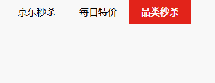

---

---

# Vue入门02

## 指令补充

### 指令修饰符

通过`"."`指明一些指令后缀，不同后缀封装了不同的处理操作，便于简化代码

#### 按键修饰符

`@keyup.enter`：键盘回车监听

语法：`@keyup.enter=事件处理函数`

- `@keyup`是任何按键时都会触发事件

#### v-model修饰符

`v-model.trim`：去除首尾空格

`v-model.number`：转数字

语法：与`v-model`语法一致，后面接双向绑定的vue数据

#### 时间修饰符

`@事件名.stop`：阻止冒泡

`@事件名.prevent`：阻止默认行为


## v-bind对于样式控制的增强

为便于开发者进行样式控制，Vue扩展了`v-bind`语法，可以针对`class类名`和`style行内样式`进行控制

### v-bind操作class
### v-bind对于样式控制的增强

为便于开发者进行样式控制，Vue扩展了`v-bind`语法，可以针对`class类名`和`style行内样式`进行控制

#### v-bind操作class
语法：`:class="对象/数组"`

- 对象，键就是类名，值是布尔值，如果值为`true`，则有这个类，否则没有

```html
<!-- 例如 -->
<div class="box" :class="{类名1:布尔值,类名2:布尔值,...}"></div>
```

- 数组，数组中所有的类都会添加到盒子上，本质就是一个`class列表`

```html
<div class="box" :class="[类名1,类名2,类名3,...]"></div>
```

这样通过给标签设置不同的类名，便于其根据情况切换不同的样式

```html
<!DOCTYPE html>
<html lang="en">
<head>
    <meta charset="UTF-8">
    <meta name="viewport" content="width=device-width, initial-scale=1.0">
    <title>Document</title>
    <style>
        .box{
            margin: 10px auto;
            width: 300px;
            height: 300px;
            border: 1px solid;
        }
        .pink{
            background-color: pink;
        }
        .big{
            width: 600px;
            height: 600px;
        }
    </style>
</head>
<body>
    <div id="app">
        <div class="box" :class="{pink:true,big:true}">样式切换</div>
    </div>
    <script src="https://cdn.jsdelivr.net/npm/vue@2/dist/vue.js"></script>
    <script>
        const app = new Vue({
            el:"#app",
            data:{

            }
        })
    </script>
</body>
</html>
```

实际应用场景：

网页tab页面高亮，比如不同的栏目模块

```html
<!DOCTYPE html>
<html lang="zh-CN">

<head>
    <meta charset="UTF-8">
    <meta name="viewport" content="width=device-width, initial-scale=1.0">
    <title>导航栏示例</title>
    <style>
        body {
            font-family: Arial, sans-serif;
        }

        .navbar {
            display: flex;
            background-color: #f8f8f8;
            border-bottom: 1px solid #ddd;
        }

        .navbar-item {
            padding: 10px 20px;
            cursor: pointer;
            text-align: center;
        }

        .navbar-item.active {
            background-color: #e2231a;
            color: white;
            font-weight: bold;
        }
    </style>
</head>

<body>
    <div id="app">
        <div class="navbar">
            <div class="navbar-item" v-for="item in tabList" :class="{active:item.isActive}"
            @click="add(item.id)">{{item.name}}</div>
        </div>
    </div>
    <script src="https://cdn.jsdelivr.net/npm/vue@2/dist/vue.js"></script>
    <script>
        const app = new Vue({
            el:"#app",
            data:{
                tabList:[{"id":1,"name":"京东秒杀","isActive":false}
                    ,{"id":2,"name":"每日特价","isActive":false}
                    ,{"id":3,"name":"品类秒杀","isActive":false}
                ]
            },
            methods:{
                add(id){
                    this.tabList.forEach(item => {
                        item.isActive = item.id==id
                    });
                }
            }
        })
    </script>

</body>

</html>
```



### v-bind操作style
#### v-bind操作style
语法：`:style="样式对象"`

```html
<!--示例-->
<div class="box" :style="{ccs属性名1：css属性值,css属性名2：css属性值}"></div>
```

```html
<body>
    <div id="app">
        <p :style='{color:"red",width:"100px",height:"30px",border:"1px solid"}'>style样式</p>
    </div>
    <script src="https://cdn.jsdelivr.net/npm/vue@2/dist/vue.js"></script>
    <script>
        const app = new Vue({
            el:"#app",
            data:{

            }
        })
    </script>
</body>
```

### v-model应用于其他表单元素

所有常见的表单元素均可以用`v-model`绑定关联，进行双向绑定，能够快速获取或者设定表单元素的值

`v-model`能够根据控件类型，自动选取正确的方法来更新元素

```html
<body>
    <div id="app">
        <input type="text" placeholder="用户名" v-model="inputText"/>
        <br/>
        <textarea placeholder="长文本" v-model="textArea"></textarea>
        <br/>
        <label>篮球</label><input type="checkbox" value="篮球" name="hobby" v-model="hobby"/>
        <label>足球</label><input type="checkbox" value="足球" name="hobby"v-model="hobby"/>
        <label>乒乓球</label><input type="checkbox" value="乒乓球" name="hobby" v-model="hobby"/>
        <br/>
        <label>男</label><input type="radio" value="男" name="gender" v-model="gender"/>
        <label>女</label><input type="radio" value="女" name="gender" v-model="gender"/>
        <br/>
        <select v-model="nation">
            <option value="中国">中国</option>
            <option value="韩国">韩国</option>
            <option value="日本">日本</option>
        </select>
    </div>
    <script src="https://cdn.jsdelivr.net/npm/vue@2/dist/vue.js"></script>
    <script>
        const app = new Vue({
            el:"#app",
            data:{
                inputText:"啦啦啦啦啦",
                textArea:"好好看看啦啦啦",
                hobby:["篮球","乒乓球"],
                gender:"女",
                nation:"日本"
            }
        })
    </script>
</body>
```


## computed属性

### 计算属性介绍

语法：

- 声明在`computed`配置项中，一个计算属性对应一个函数
- 使用起来和普通属性一样使用`{{计算属性名}}`

```html
computed:{
	计算属性名(){
		基于现有数据，编写求值逻辑
		return 结果
	}
}
```

```html
<body>
    <div id="app">
        <h1>礼物清单</h1>
        <table>
            <tr v-for="item in goods" :key="item.id">
                <td>{{item.name}}</td>
                <td>{{item.num}}个</td>
            </tr>
        </table>
        <div class="count">礼物总数:{{allCount}}</div>
    </div>
    <script src="https://cdn.jsdelivr.net/npm/vue@2/dist/vue.js"></script>
    <script>
        const app = new Vue({
            el: "#app",
            data: {
                goods: [{ id: 1, name: "篮球", num: 1 }
                    , { id: 2, name: "玩具", num: 2 }
                    , { id: 3, name: "足球", num: 6 }
                ]
            },
            computed: {
                allCount(){
                    return this.goods.reduce((sum,item)=>
                        sum+item.num,0)
                }
            }
        })
    </script>
</body>
```

### computed计算属性 vs methods方法

#### computed计算属性

功能：封装了一段对于数据的处理，求得一个结果

语法：

- 写在`computed`配置项中
- 作为属性，直接使用`this.计算属性`或者`{{计算属性}}`

缓存特性：

- 能够一定程度上提升性能，计算属性会对计算出来的结果进行缓存，再次使用时直接读取缓存，如果依赖项发生了变化，会自动计算新的结果并再次缓存

#### methods方法

功能：封装了处理业务逻辑，给实例提供一个方法

语法：

- 写在`methods`配置项中
- 作为方法，需要调用`this.方法名()`或者`@事件名=方法名`

### 计算属性完整写法

上述是计算属性的简写，这种情况下只能访问，不能修改属性，如果要修改属性，则需要写计算属性的完整写法

**计算属性的完整写法**

```html
computed:{
	计算属性名:{
		get(){
			代码逻辑（数据计算逻辑）
			return 结果
		},
		set(){
			代码逻辑（数据修改逻辑）
		}
	}
}
```

**实例**

```html
<body>
  <div id="app">
    <div class="box">
      <label>姓:</label><input type="text" v-model="firstName" />
      <label>名:</label><input type="text" v-model=lastName />
      <span>={{name}}</span>
    </div>
    <input type="text" placeholder="输入新的名字" v-model="inputName" />
    <button @click="alertName">改名</button>
  </div>
  <script src="https://cdn.jsdelivr.net/npm/vue@2/dist/vue.js"></script>
  <script>
    const app = new Vue({
      el: "#app",
      data: {
        firstName: "李",
        lastName: "白",
        inputName: ""
      },
      methods: {
        alertName() {
          this.name = this.inputName
        }
      },
      computed: {
        name: {
          get() {
            return this.firstName + this.lastName
          },
          //修改赋值时，value极为传入的新赋予的值
          set(value) {
            this.firstName = value.substring(0, 1)
            this.lastName = value.substring(1, value.length)
          }
        }
      }
    })
  </script>
</body>
```

## watch监听器

### 概述

功能：监视一些数据变化，执行相应的业务逻辑或者异步操作

应用场景分析：在线翻译栏，左边用户输入内容，右边会实时显示翻译内容

语法：

- 简单写法：监听简单类型数据

- 完整写法：需要添加额外的配置

### 简单写法

**语法**

```html
<!--示例-->
data:{
	words:"苹果",
	obj:{
		words:"苹果"
	}
}
<!--监视器-->
watch:{
	//数据变化时会触发对应的操作
	//newValue为新值，oldValue为老值
	数据属性名(newValue,oldValue){
		对应数据变化的业务逻辑或者异步操作
	},
	'对象.属性名'(newValue,oldValue){
		对应数据变化的业务逻辑或者一部操作
	}
}
```

**实例**

```html
<body>
  <div id="app">
    <div>
      <label>输入内容</label><br />
      <textarea v-model="words"></textarea>
    </div>
    <div>
      <label>翻译内容</label><br />
      <textarea v-model="translateWords"></textarea>
    </div>
  </div>
  <script src="https://cdn.jsdelivr.net/npm/vue@2/dist/vue.js"></script>
  <script>
    const app = new Vue({
      el: "#app",
      data: {
        words: "",
        translateWords: ""
      },
      watch: {
        words(newValue, oldValue) {
          this.translateWords = newValue.toUpperCase()
        }
      }

    })
  </script>
</body>
```

如何是调用后端API接口进行相关的操作，这时候要注意性能的影响，采取**防抖**，来避免频繁触发调用

### 完整写法

完整写法需要额外配置项

- deep:true，对复杂数据类型深度监视 ，
- immediate:true，初始化立刻执行一次handler方法

应用场景分析：仍然是文本翻译场景，但是，不仅用户输入内容，实时显示当前文本翻译结果，当用户切换语言类型时，也需要翻译当前文本内容，这时就需要同时监听一个对象的多个属性

**语法**

```html
data:{
	obj:{
		words:"苹果",
		lang:"En"
	}
},
watch:{
	数据属性名:{
		deep:true,
		handler(newValue){

		}
	}
}
```

**实例**

```html
<body>
  <div id="app">
    <div>
      <select v-model="transObj.lang">
        <option value="大写">大写</option>
        <option value="小写">小写</option>
      </select>
    </div>
    <div>
      <label>输入内容</label><br />
      <textarea v-model="transObj.words"></textarea>
    </div>
    <div>
      <label>翻译内容</label><br />
      <textarea v-model="translateWords"></textarea>
    </div>
  </div>
  <script src="https://cdn.jsdelivr.net/npm/vue@2/dist/vue.js"></script>
  <script>
    const app = new Vue({
      el: "#app",
      data: {
        transObj: {
          words: "",
          lang: ""
        },
        translateWords: ""
      },
      watch: {
        transObj: {
          deep: true,
          handler(newValue) {
            if (newValue.lang == "大写") {
              this.translateWords = newValue.words.toUpperCase()
            } else if (newValue.lang == "小写") {
              this.translateWords = newValue.words.toLowerCase()
            }
          }
        }
      }

    })
  </script>
</body>
```
## 综合案例：购物车


