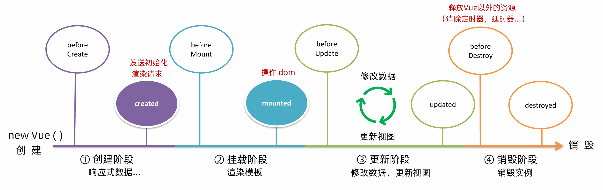
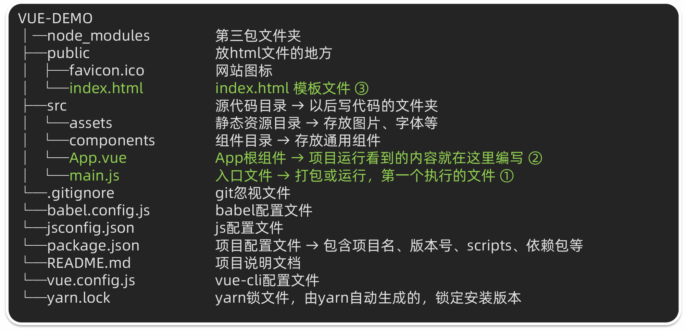
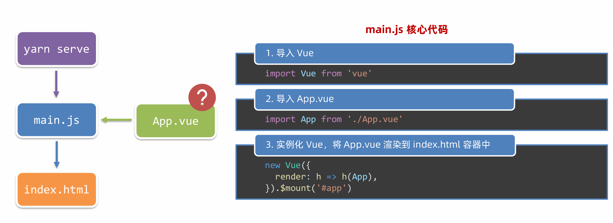
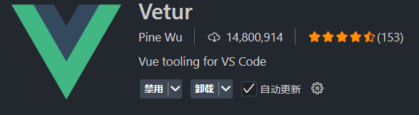

---

---

# `vue快速入门03`

## 生命周期

### vue生命周期的四个阶段

vue对象从创建到销毁的整个过程

Vue生命周期的四个阶段：

- 创建
  - 初始化操作，普通数据转变为响应式数据
  - 该阶段可以发送初始化渲染请求
- 挂载
  - 渲染模板
  - 该阶段才可以开始操作dom
- 更新
  - 数据修改，更新视图
- 销毁
  - 销毁实例

### vue生命周期函数（钩子函数）

在vue生命周期过程中，会自动运行一些函数，本称之为**生命周期钩子**，可以让开发者在**特定阶段**运行自己的代码

在整个生命周期中一共8个钩子函数，如下图所示：



```html
<body>
  <div id="app">
    <div class="counter">
      <h1>{{title}}</h1>
      <div class="buttons">
        <button class="button" @click="number--">-</button>
        <div class="value" id="value">{{number}}</div>
        <button class="button" @click="number++">+</button>
      </div>
    </div>
  </div>
  <script src="https://cdn.jsdelivr.net/npm/vue@2/dist/vue.js"></script>
  <script>
    const app = new Vue({
      el: "#app",
      data: {
        title: "计数器",
        number: 100
      },
      //1.创建阶段，完成初始化，准备数据
      beforeCreate() {
        console.log("响应式数据准备之前")
      },
      created() {
        console.log("响应式数据准备之后")
        //在这个钩子函数里可以执行渲染数据请求
        this.number = 200
      },
      //2.挂载阶段（渲染模板）
      beforeMount() {
        console.log("模板渲染之前", document.querySelector("h1").innerHTML)
      },
      mounted() {
        console.log("模板渲染之后", document.querySelector("h1").innerHTML)
        //这个阶段之后，就可以操作dom
      },
      //3.更新阶段，改变数据，更新视图
      beforeUpdate() {
        //更新之前的视图
        console.log("数据修改了，但视图并未更新", document.querySelector(".value").innerHTML)
      },
      updated() {
        //更新之后的视图
        console.log("数据修改了，视图已经更新", document.querySelector(".value").innerHTML)
      },
      //4.销毁阶段
      //执行 实例名.$destroy()，可以手动销毁实例
      beforeDestroy() {
        console.log("beforeDestroy")
        //该阶段一般用于销毁实例之前关闭一些第三方的资源占用
      },
      destoyed() {
        console.log("destroyed")
      }
    })
  </script>
</body>
```

实例：搜索框一进入页面立刻获取焦点

```html
<!DOCTYPE html>
<html lang="zh-CN">

<head>
  <meta charset="UTF-8">
  <meta name="viewport" content="width=device-width, initial-scale=1.0">
  <title>搜索页面</title>
  <style>
    body {
      display: flex;
      justify-content: center;
      align-items: center;
      height: 100vh;
      margin: 0;
      background-color: #f0f0f0;
      font-family: Arial, sans-serif;
    }

    .search-container {
      text-align: center;
    }

    .logo {
      display: flex;
      align-items: center;
      justify-content: center;
      margin-bottom: 20px;
    }

    .logo-text {
      font-size: 1.5em;
      font-weight: bold;
    }

    .search-bar {
      display: flex;
      align-items: center;
      border: 1px solid #ccc;
      border-radius: 5px;
      overflow: hidden;
    }

    .search-bar input {
      flex: 1;
      padding: 10px;
      border: none;
      outline: none;
    }

    .search-button {
      padding: 10px 20px;
      background-color: #c43c3c;
      color: white;
      border: none;
      cursor: pointer;
      outline: none;
    }
  </style>
</head>

<body>
  <div id="app">
    <div class="search-container">
      <div class="logo">
        <div class="logo-text">搜索一下</div>
      </div>
      <div class="search-bar">
        <input type="text" placeholder="搜索内容...">
        <button class="search-button">搜索一下</button>
      </div>
    </div>
  </div>
  <script src="https://cdn.jsdelivr.net/npm/vue@2/dist/vue.js"></script>
  <script>
    const app = new Vue({
      el: "#app",
      data: {

      },
      mounted() {
        //输入框获取焦点
        document.querySelector(".search-bar input").focus()
      }
    })
  </script>
</body>

</html>
```

## 工程化开发入门

### 开发Vue的两种方式

- 核心包传统开发方式：基于`html/css/js`文件，直接引入核心包,开发Vue
- 工程化开发模式：基于构建工具（例如`webpack`)的环境中开发Vue

### 脚手架 Vue CLI

`Vue CLI`是`Vue`官方提供的一个全局命令工具，可以帮助我们快速创建一个开发`Vue`项目的标准化基础架子（集成了Webpack配置）

好处：

- 开箱即用，零配置
- 内置babel等工具
- 标准化

**使用步骤：**

1. 全局安装（初次使用时执行）：`npm i @vue/cli -g`或者`yarn global add @vue/cli`
2. 查看`vue`版本：`vue --version`
3. 创建项目架子：`vue create project-name`（注意：项目名不能用中文）
4. 启动项目：`npm run serve`或者`yarn serve`（具体启动的命令参考项目中的`package.json`）


### 文件目录结构

利用脚手架创建出来的项目的目录结构



项目运行解析流程



### 组件化开发

**组件化**

一个页面可以拆分成一个个组件，每个组件有着自己独立的结构、样式、行为。

组件化可以便于维护，利于复用，从而提高开发效率

组件可以分为两类：

- 普通组件
- 根组件
  - `App.vue`文件，整个应用最上层的组件，包裹所有普通小组件

**App.vue文件**

`App.vue`文件（单个组件文件）包含三个组成部分

- `template`：结构，有且只有一个根元素
- `script`：js逻辑代码
- `style`：样式

```vue
<template>
  <!--组件的结构代码-->
  <div class="father">
    <div class="son" @click="show">大的</div>
  </div>
</template>

<script>
//导出当前组件的配置项
//里面可以提供data、methods、computed、watch、生命周期钩子函数等
  export default{
    methods:{
      show(){
        alert("你点击了son div元素")
      }
    }
  }
</script>

<style>
  .father{
    width: 300px;
    height: 300px;
    background-color: blue;
  }
  .son{
    width: 100px;
    height: 100px;
    background-color: red;
  }
</style>
```

补充：`vscode`语法高亮插件`Vetur`




## 综合案例--小兔鲜首页