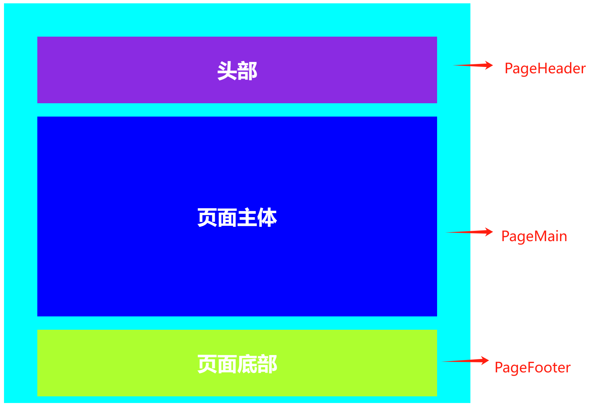
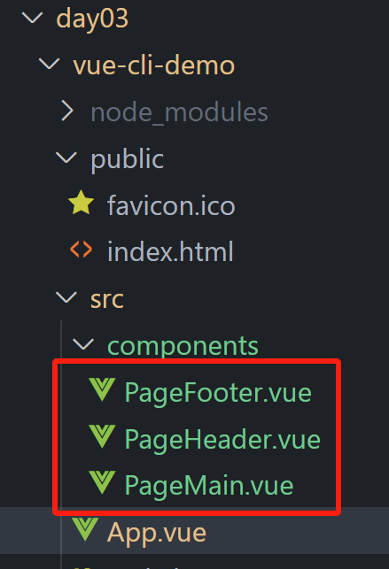

---

---

# `vue快速入门03`

## 生命周期

### vue生命周期的四个阶段

vue对象从创建到销毁的整个过程

Vue生命周期的四个阶段：

- 创建
  - 初始化操作，普通数据转变为响应式数据
  - 该阶段可以发送初始化渲染请求
- 挂载
  - 渲染模板
  - 该阶段才可以开始操作dom
- 更新
  - 数据修改，更新视图
- 销毁
  - 销毁实例

### vue生命周期函数（钩子函数）

在vue生命周期过程中，会自动运行一些函数，本称之为**生命周期钩子**，可以让开发者在**特定阶段**运行自己的代码

在整个生命周期中一共8个钩子函数，如下图所示：


```html
<body>
  <div id="app">
    <div class="counter">
      <h1>{{title}}</h1>
      <div class="buttons">
        <button class="button" @click="number--">-</button>
        <div class="value" id="value">{{number}}</div>
        <button class="button" @click="number++">+</button>
      </div>
    </div>
  </div>
  <script src="https://cdn.jsdelivr.net/npm/vue@2/dist/vue.js"></script>
  <script>
    const app = new Vue({
      el: "#app",
      data: {
        title: "计数器",
        number: 100
      },
      //1.创建阶段，完成初始化，准备数据
      beforeCreate() {
        console.log("响应式数据准备之前")
      },
      created() {
        console.log("响应式数据准备之后")
        //在这个钩子函数里可以执行渲染数据请求
        this.number = 200
      },
      //2.挂载阶段（渲染模板）
      beforeMount() {
        console.log("模板渲染之前", document.querySelector("h1").innerHTML)
      },
      mounted() {
        console.log("模板渲染之后", document.querySelector("h1").innerHTML)
        //这个阶段之后，就可以操作dom
      },
      //3.更新阶段，改变数据，更新视图
      beforeUpdate() {
        //更新之前的视图
        console.log("数据修改了，但视图并未更新", document.querySelector(".value").innerHTML)
      },
      updated() {
        //更新之后的视图
        console.log("数据修改了，视图已经更新", document.querySelector(".value").innerHTML)
      },
      //4.销毁阶段
      //执行 实例名.$destroy()，可以手动销毁实例
      beforeDestroy() {
        console.log("beforeDestroy")
        //该阶段一般用于销毁实例之前关闭一些第三方的资源占用
      },
      destoyed() {
        console.log("destroyed")
      }
    })
  </script>
</body>
```

实例：搜索框一进入页面立刻获取焦点

```html
<!DOCTYPE html>
<html lang="zh-CN">

<head>
  <meta charset="UTF-8">
  <meta name="viewport" content="width=device-width, initial-scale=1.0">
  <title>搜索页面</title>
  <style>
    body {
      display: flex;
      justify-content: center;
      align-items: center;
      height: 100vh;
      margin: 0;
      background-color: #f0f0f0;
      font-family: Arial, sans-serif;
    }

    .search-container {
      text-align: center;
    }

    .logo {
      display: flex;
      align-items: center;
      justify-content: center;
      margin-bottom: 20px;
    }

    .logo-text {
      font-size: 1.5em;
      font-weight: bold;
    }

    .search-bar {
      display: flex;
      align-items: center;
      border: 1px solid #ccc;
      border-radius: 5px;
      overflow: hidden;
    }

    .search-bar input {
      flex: 1;
      padding: 10px;
      border: none;
      outline: none;
    }

    .search-button {
      padding: 10px 20px;
      background-color: #c43c3c;
      color: white;
      border: none;
      cursor: pointer;
      outline: none;
    }
  </style>
</head>

<body>
  <div id="app">
    <div class="search-container">
      <div class="logo">
        <div class="logo-text">搜索一下</div>
      </div>
      <div class="search-bar">
        <input type="text" placeholder="搜索内容...">
        <button class="search-button">搜索一下</button>
      </div>
    </div>
  </div>
  <script src="https://cdn.jsdelivr.net/npm/vue@2/dist/vue.js"></script>
  <script>
    const app = new Vue({
      el: "#app",
      data: {

      },
      mounted() {
        //输入框获取焦点
        document.querySelector(".search-bar input").focus()
      }
    })
  </script>
</body>

</html>
```

## 工程化开发入门

### 开发Vue的两种方式

- 核心包传统开发方式：基于`html/css/js`文件，直接引入核心包,开发Vue
- 工程化开发模式：基于构建工具（例如`webpack`)的环境中开发Vue

### 脚手架 Vue CLI

`Vue CLI`是`Vue`官方提供的一个全局命令工具，可以帮助我们快速创建一个开发`Vue`项目的标准化基础架子（集成了Webpack配置）

好处：

- 开箱即用，零配置
- 内置babel等工具
- 标准化

**使用步骤：**

1. 全局安装（初次使用时执行）：`npm i @vue/cli -g`或者`yarn global add @vue/cli`
2. 查看`vue`版本：`vue --version`
3. 创建项目架子：`vue create project-name`（注意：项目名不能用中文）
4. 启动项目：`npm run serve`或者`yarn serve`（具体启动的命令参考项目中的`package.json`）


### 文件目录结构

利用脚手架创建出来的项目的目录结构


项目运行解析流程


### 组件化开发

**组件化**

一个页面可以拆分成一个个组件，每个组件有着自己独立的结构、样式、行为。

组件化可以便于维护，利于复用，从而提高开发效率

组件可以分为两类：

- 普通组件
- 根组件
  - `App.vue`文件，整个应用最上层的组件，包裹所有普通小组件

**App.vue文件**

`App.vue`文件（单个组件文件）包含三个组成部分

- `template`：结构，有且只有一个根元素
- `script`：js逻辑代码
- `style`：样式

```vue
<template>
  <!--组件的结构代码-->
  <div class="father">
    <div class="son" @click="show">大的</div>
  </div>
</template>

<script>
//导出当前组件的配置项
//里面可以提供data、methods、computed、watch、生命周期钩子函数等
  export default{
    methods:{
      show(){
        alert("你点击了son div元素")
      }
    }
  }
</script>

<style>
  .father{
    width: 300px;
    height: 300px;
    background-color: blue;
  }
  .son{
    width: 100px;
    height: 100px;
    background-color: red;
  }
</style>
```

补充：`vscode`语法高亮插件`Vetur`


### 普通组件的注册使用

####  组件注册的两种方式

##### 局部注册

只能在注册的组件内使用

1. 创建`.vue`文件
2. 在使用的组件内导入并注册

```vue
<!--导入-->
import 组件名 from 'xxx.vue'
<!--注册-->
export default{
	components:{
		组件名称:导入的组件名
	}
}
```

使用的时候，直接当成`html`标签使用，`<组件名></组件名>`

注意组件名的命名规范：大驼峰命名法，比如`XxxHhhh`

**使用实例**



将上图中的页面拆分为三个不同的组件：`PageHeader`、`PageMain`、`PageFooter`



`PageHeader`代码

```vue
<!--页面头部组件-->
<template>
  <div class="header">头部</div>
</template>

<script>
export default {

}
</script>

<style>
  .header{
    height: 100px;
    background-color: blueviolet;
    text-align: center;
    line-height: 100px;
    font-size: 30px;
    color: white;
    font-weight: 700;
  }
</style>
```

`PageMain`代码

```vue
<!--页面头部组件-->
<template>
  <div class="main">页面主体</div>
</template>

<script>
export default {

}
</script>

<style>
  .main{
    margin: 20px 0;
    height: 300px;
    background-color: blue;
    text-align: center;
    line-height: 300px;
    font-size: 30px;
    color: white;
    font-weight: 700;
  }
</style>
```

`PageFooter`代码

```vue
<!--页面头部组件-->
<template>
  <div class="footer">页面底部</div>
</template>

<script>
export default {

}
</script>

<style>
  .footer{
    height: 100px;
    background-color: greenyellow;
    text-align: center;
    line-height: 100px;
    font-size: 30px;
    color: white;
    font-weight: 700;
  }
</style>
```

`App.vue`代码

```vue
<template>
  <div class="app">
    <MyHeader></MyHeader>
    <MyMain></MyMain>
    <MyFooter></MyFooter>
  </div>
</template>

<script>
import PageHeader from './components/PageHeader.vue';
import PageMain from './components/PageMain.vue';
import PageFooter from './components/PageFooter.vue';

export default {
  components:{
    MyHeader:PageHeader,
    MyMain:PageMain,
    MyFooter:PageFooter
  }
}
</script>

<style>
  .app{
    margin: 10px auto;
    padding: 50px;
    width: 600px;
    height: 500px;
    background-color: aqua;
    text-align: center;
  }
</style>
```

##### 全局注册

在所有组件内都能使用

1.  创建`.vue`文件
2. 在`main.js`中进行全局注册

在各个组件中均使用的通用组件，就可以把它定义为全局组件

全局注册的语法

```js
//导入需要注册的组件
import 组件名 from "xxxx.vue"

//调用Vue.component进行全局注册
//Vue.component('组件名',组件对象)
```

全局注册之后，任意其他组件中均可直接使用（不用在使用的组件内导入注册该组件），使用的时候，直接当成`html`标签使用，`<组件名></组件名>`

## 总结

项目页面开发的思路

1. 分析页面，按照模块对页面进行拆分，搭架子（一般局部注册，在多个组件中均使用的组件，可以考虑进行全局注册）
2. 根据设计图，编写组件`html`结构和`css`样式
3. 拆分封装通用的小组件
4. 实现完静态结构后，通过`js`动态渲染，实现页面的相关功能