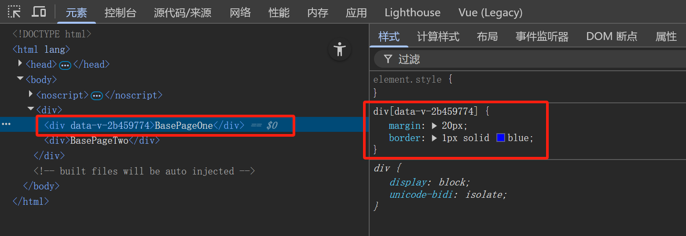
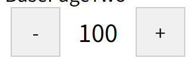

---

---

# Vue快速入门04


## 组件组成三个部分

组件的三大组成部分：

- 结构`<template>`
  - 只能有一个根元素`<div>`

- 样式`<style>`
  - 全局样式（默认）：影响所有组件
  - 局部样式：`scoped`下样式，只用于当前组件 
- 逻辑`<script>`
  - `el`根实例独有，`data`是一个函数，其他配置项与引入核心库开发一样的

### 样式--scoped

**默认情况：**写在组件中的样式会全局生效，因此很容易造成多个组件之间的样式冲突问题

- 全局样式：默认组件中的样式会作用到全局

- 局部样式：可以给组件加上`scoped`属性，可以让样式只作用于当前组件

  ```vue
  <style scoped>
  </style>
  ```

为避免不同组件样式冲突，建议给每个组件加上`scoped`

**scoped原理**

1. 给当前组件内所有的标签都会添加`data-v-hash值`的属性
2. `css`选择器都被添加`[data-v-hash值]`的属性选择器

最终导致必须是当前组件的元素，最会有这个自定义属性，才会被这个样式作用到



###  逻辑--data是一个函数

一个组件的`data`选项必须是一个函数，这样的好处是：保证每个组件实例，维护独立的一份数据对象

每次创建新的组件实例，都会重新执行一次`data`函数，得到一个新对象

```vue
<script>
	export default{
        data(){
            return{
                属性名:属性值
            }
        }
    }
</script>
```

**实例**

```vue
<template>
  <div>
    <div class="button-container">
      <div class="button" @click="number--">-</div>
      <div class="number">{{ number }}</div>
      <div class="button" @click="number++">+</div>
    </div>
  </div>
</template>
<script>
export default {
  data(){
    return{
      number:100
    }
  }
}
</script>
<style scoped>
  .button-container {
    display: flex;
    align-items: center;
  }

  .button {
    width: 40px;
    height: 40px;
    border: 1px solid #ccc;
    display: flex;
    justify-content: center;
    align-items: center;
    margin: 0 5px;
    cursor: pointer;
    background-color: #f0f0f0;
  }

  .number {
    font-size: 20px;
    margin: 0 10px;
  }
</style>
```



## 组件通信

### 概述

 组件通信，指的是 **组件与组件** 之间的**数据传递**

- 组件的数据是独立的，无法直接访问其他组件的数据
- 如果想要使用其他组件的数据，组需要利用组件通信机制

#### 组件关系及其对应通信方案

不同组件关系，其组件通信方案也不一样

组件关系分类：

- 父子关系
  - 组件间通信方案：`props`和`$emit`
- 非父子关系
  - 组件间通信方案：`provide & inject`和`eventbus`

通用的解决方案`Vuex`，适用于复杂的业务场景

##### 父子通信

###### 父组件通过`props`将数据传递给子组件

1. 在父组件中给子组件以添加属性的方式传递值
2. 在子组件中通过`props`接收数据


###### 子组件利用`$emit`通知父组件修改更新


## 综合案例


## 进阶语法


