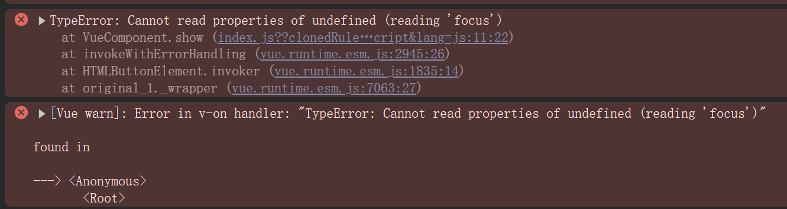

---

---

# Vue快速入门04


## 组件组成三个部分

组件的三大组成部分：

- 结构`<template>`
  - 只能有一个根元素`<div>`

- 样式`<style>`
  - 全局样式（默认）：影响所有组件
  - 局部样式：`scoped`下样式，只用于当前组件 
- 逻辑`<script>`
  - `el`根实例独有，`data`是一个函数，其他配置项与引入核心库开发一样的

### 样式--scoped

**默认情况：**写在组件中的样式会全局生效，因此很容易造成多个组件之间的样式冲突问题

- 全局样式：默认组件中的样式会作用到全局

- 局部样式：可以给组件加上`scoped`属性，可以让样式只作用于当前组件

  ```vue
  <style scoped>
  </style>
  ```

为避免不同组件样式冲突，建议给每个组件加上`scoped`

**scoped原理**

1. 给当前组件内所有的标签都会添加`data-v-hash值`的属性
2. `css`选择器都被添加`[data-v-hash值]`的属性选择器

最终导致必须是当前组件的元素，最会有这个自定义属性，才会被这个样式作用到


###  逻辑--data是一个函数

一个组件的`data`选项必须是一个函数，这样的好处是：保证每个组件实例，维护独立的一份数据对象

每次创建新的组件实例，都会重新执行一次`data`函数，得到一个新对象

```vue
<script>
	export default{
        data(){
            return{
                属性名:属性值
            }
        }
    }
</script>
```

**实例**

```vue
<template>
  <div>
    <div class="button-container">
      <div class="button" @click="number--">-</div>
      <div class="number">{{ number }}</div>
      <div class="button" @click="number++">+</div>
    </div>
  </div>
</template>
<script>
export default {
  data(){
    return{
      number:100
    }
  }
}
</script>
<style scoped>
  .button-container {
    display: flex;
    align-items: center;
  }

  .button {
    width: 40px;
    height: 40px;
    border: 1px solid #ccc;
    display: flex;
    justify-content: center;
    align-items: center;
    margin: 0 5px;
    cursor: pointer;
    background-color: #f0f0f0;
  }

  .number {
    font-size: 20px;
    margin: 0 10px;
  }
</style>
```


## 组件通信

### 概述

 组件通信，指的是 **组件与组件** 之间的**数据传递**

- 组件的数据是独立的，无法直接访问其他组件的数据
- 如果想要使用其他组件的数据，组需要利用组件通信机制

### 组件关系及其对应通信方案

不同组件关系，其组件通信方案也不一样

组件关系分类：

- 父子关系
  - 组件间通信方案：`props`和`$emit`
- 非父子关系
  - 组件间通信方案：`provide & inject`和`eventbus`

通用的解决方案`Vuex`，适用于复杂的业务场景

#### 父子通信

**父组件通过`props`将数据传递给子组件**

1. 在父组件中给子组件以添加属性的方式传递值
2. 在子组件中通过`props`接收数据

**子组件利用`$emit`通知父组件修改更新**

1. 子组件`$emit`发送消息·
2. 父组件中给子组件添加消息监听
3. 父组件中实现相应的处理函数

**实例**

`父组件代码`

```vue
<template>
  <div>
    <div>父组件</div>
     //父组件对消息监听
    <SonPage :message="message" @changeMsg="changeFunc"></SonPage>
  </div>
</template>

<script>
import SonPage from './components/SonPage.vue';
export default {
  components:{
    SonPage:SonPage
  },methods:{
    changeFunc(text){
      this.message=text
    }
  },
  data(){
    return {
      message:"该数据来源于父组件"
    }
  }
}
</script>

<style>

</style>
```

`子组件代码`

```vue
<template>
  <div>
    <div>子组件接收的数据:{{ message }}</div>
    <button @click="handleChange">改变接收数据内容</button>
  </div>
</template>

<script>
export default {
  props:["message"],
  methods:{
    handleChange(){
      //$emit出发事件，会给父组件发送对应的消息通知
      this.$emit("changeMsg","子组件改变后的内容")
    }
  }
}
</script>

<style>

</style>
```


#### Prop

`Prop`定义：组件上注册的一些自定义属性

`Prop`作用：向子组件传递数据

特点：

- 可以传递任意数量的prop
- 可以传递任意类型的prop

##### Prop校验

为保证组件的`Prop`不乱传，可以为组件的`Prop`指定验证要求，不符合要求，控制台就会有错误提示

常见的校验：

- 类型校验

```vue
props:{
	校验的属性名:类型//Number String Boolean ...
}
```

- 非空校验
- 默认值
- 自定义校验

如果需要满足多个校验的要求，完整的写法如下：

```vue
props:{
	校验的属性名:{
		type:类型, //Number String Boolean  类型校验
		required: true,//是否是必须的，非空校验
		default:默认值,//默认值
		validator(value){
			//自定义校验逻辑
			return 是否通过校验 //true通过校验,false没通过校验
		}
	}
}
```


##### Prop vs data

共同点：都可以给组件提供数据

区别：

- data数据是自己的，可以随便改
- prop数据是外部父组件提供的，不能直接更改，遵循单向数据流


#### 非父子组件通信

##### 方式一：event bus事件总线

作用：非父子组件之间，进行简易消息传递，复杂场景简易使用`Vuex`

使用语法：

1. 创建一个都能访问到的事件总线（空Vue实例）

   ```vue
   import Vue from 'vue'
   const Bus = new Vue()
   export default Bus
   ```

2. A组件（接收方），监听Bus实例的事件

   ```vue
   created(){ //监听事件，出触发对应动作
   	Bus.$on('sendMsg',(msg)=>{
   		this.msg = msg
   	})
   }
   ```

3. B组件（发送方），触发Bus实例的事件

   ```vue
   Bus.$emit("sendMsg","传递的消息内容")
   ```

   

##### 方式二：provide & inject

`provide & inject`作用：跨层级（爷爷辈组件提供的数据，子孙辈均可直接使用）共享数据

1. 父组件provide提供数据

```vue
export default{
    provide(){
        //不同数据类型的数据
        //注意简单数据类型是非响应式的数据，复杂类型是响应式的，所以如果使用这种方式，建议将所有数据封装成对象进行传递
        数据名1:数据值1,
        xxx:xxxx
    }
}
```

1. 子/孙组件inject取值使用

```vue
export default{
	inject: ['对应的数据名1','对应的数据名2']
}
```


## 进阶语法

### v-model原理

原理：`v-model`本质是一个语法糖，例如应用在`input`输入框，其就相当于`value`属性和`input`事件的合写

作用：提供数据的双向绑定

- 数据变，视图会跟着变：`value`
- 视图变，数据会跟着变：`@input`

```vue
<input v-model="msg" type="text">
等价于
<input :value="msg" @input="msg = $event.target.value" type="text"> //$event用于模板中，获取事件的形参
```


### 表单组件封装 & v-model简化代码

#### 表单组件封装

- 父传子：数据应该是父组件`Props`传递过来的，`v-model`拆解绑定数据
- 子传父：监听输入，子传父，传值给父组件修改

**子组件BaseSelect封装的代码示例**

```vue
<select :value="cityId" @change="handleChange">
    ...
</select>

props:{
	cityId: String
}

methods:{
	handleChange(e){
		this.$emit("事件名",e.target.value)
	}
}
```

**父组件代码示例**

```vue
<BaseSelect :cityId="selectId" @事件名="selectId= $event"></BaseSelect>
```


#### 父组件v-model简化代码，实现父子组件数据的双向绑定

在子组件中将数据更改的事件命名为`input`，传递的数据名改为`value`，这样父组件代码就可以简写

**子组件封装代码示例**

```vue
<select :value="value" @change="handleChange">
    ...
</select>

props:{
	value:String
}

mehods:{
	handleChange(e):{
		this.$emit("input",e.target.value)
	}
}
```

**父组件代码**

```vue
<BaseSelect :value="selectId" @input="selectId=$event"></BaseSelect>
可以简化为
<BaseSelect v-model="selectId"></BaseSelect>
```


### .sync修饰符(了解)

作用：可以实现父子组件数据的双向绑定，简化代码

背景：v-model简化的前提是数据传递时`props`接收用`value`命名，但是并非所有组件用`value`都合适，而用`.sync`可以自定义`props`属性名


### ref和$refs

作用：利用`ref`和`$refs`可以用于获取`dom`元素或组件实例

**背景**：

- 利用`document.queryselector()`查找时是整个页面查找
- 利用`ref`和`$refs` 是在当前组件内查找，会更加精准准确

**语法**：

#### 获取`dom`元素

1. 目标标签添加`ref`属性，并将属性值设置为`xxx`
2. 在恰当时机(挂载之后，才可访问`dom`元素)，通过`this.$refs.xxx`获取目标标签

**示例代码**

```vue
<div ref="chartRef">渲染图标容器</div>
```

```vue
mounted(){
	console.log(this.$refs.chartRef)
}
```

#### 获取组件实例

1. 给目标组件添加`ref`属性，设置属性值为`xxx`
2. 在恰当时机，通过`$refs.xxx`获取目标组件，然后可以调用组件对象里面的方法

**示例代码**

```vue
<BaseCom ref="baseCom"></BaseCom>
```

```vue
this.$refs.baseCom.组件方法()
```


### Vue异步更新与`$nextTick`

异步更新：`Vue`是异步更新`DOM`，以提升性能

`$nextTick`：等`DOM`更新后，才会触发执行此方法里的函数体

语法：`this.$nextTick(函数体)`

**示例**

比如点击一个按钮，然后会显示一个输入框，然后让这个输入框自动获取焦点

```vue
<template>
  <div>
    <div v-if="isShow">
      <input type="text" ref="inp" />
      <button>确认</button>
    </div>
    <div v-else>
      <button @click="show">编辑</button>
    </div>
  </div>
</template>

<script>
export default {
  data() {
    return {
      isShow: false,
    };
  },
  methods: {
    show() {
      this.isShow = true;
      this.$refs.inp.focus();
    },
  },
};
</script>

<style>
</style>
```

上面这种写法是会报错的，因为`vue`是`dom`异步更新，不能立刻获取对应元素



应当借助`$nextTick`来实现该功能，等`dom`更新完，再执行对应的功能

```vue
<template>
  <div>
    <div v-if="isShow">
      <input type="text" ref="inp" />
      <button>确认</button>
    </div>
    <div v-else>
      <button @click="show">编辑</button>
    </div>
  </div>
</template>

<script>
export default {
  data() {
    return {
      isShow: false,
    };
  },
  methods: {
    show() {
      this.isShow = true;
      this.$nextTick(() => {
        this.$refs.inp.focus();
      });
    },
  },
};
</script>

<style>
</style>
```


