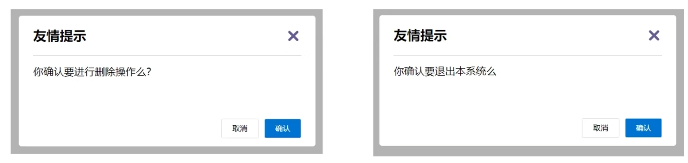
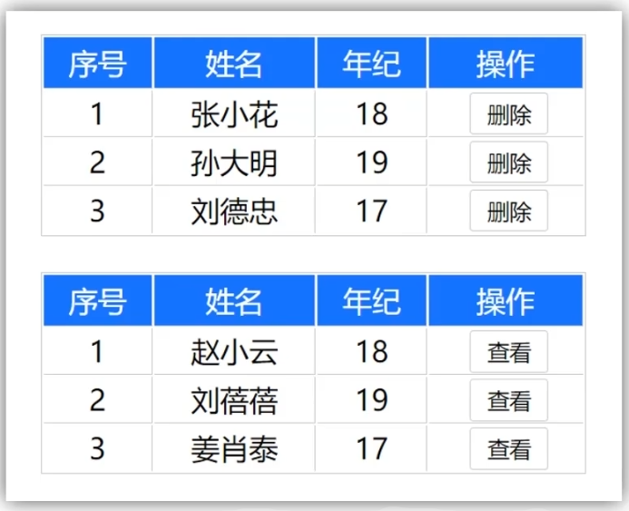
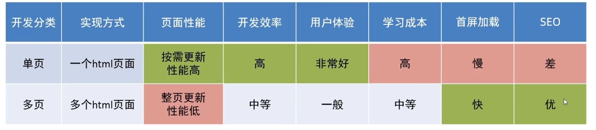
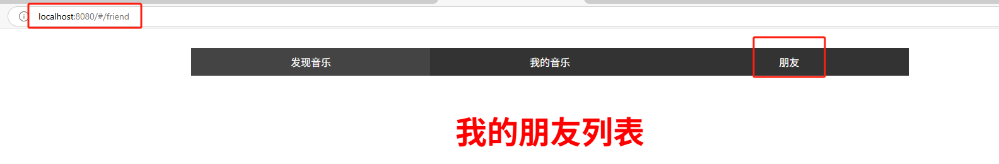

---

---

# Vue05

## 自定义指令

`v-for`、`v-model`等指令属于内置指令，每个指令都有自己独立的功能。

开发者自己定义指令，封装一些`dom`操作，扩展额外的功能

### **语法**

- 全局注册，在`main.js`中编写，在所有组件中均可使用

  ```vue
  Vue.directive(指令名,{
  	inserted(el){ //inserted指不同的生命周期，当指令绑定的元素被添加到页面的时候触发
  		//可以对el标签，扩展额外的功能，el就是指令绑定的元素
  		xxxxx
  	} 
  })
  ```

- 局部注册，只能在当前组件中使用

  ```vue
  directives:{
  	指令名:{
  		inserted:(el){
  			//可以对el标签，扩展额外的功能
  			xxxxx
  		}
  	}
  }
  ```

自定义指令使用：

```vue
直接在对应标签上添加: v-指令名
比如: <input v-指令名 type="text"/>
```

**实例**

自定义指令`v-focus`，使得页面某些元素自动聚焦

```vue
<template>
  <div>
    <input type="text" v-focus>
  </div>
</template>

<script>
export default {
  directives:{
    focus:{
      inserted(el){
        el.focus()
      }
    }
  }
}
</script>

<style>

</style>
```


### 自定义指令--指令的值

在绑定指令时，可以通过`等号`的形式为指令绑定具体的参数值

可以通过`binding.value`拿到指令值，指令值修改会触发`update`函数

**实例**

自定一个指令`color`，通过传入不同的颜色，给标签设置文字颜色

```vue
<template>
  <div>
    <span v-color="color2">we are family</span>
  </div>
</template>

<script>


export default {
  data(){
    return {
      "color1":"red",
      "color2":"blue"
    }
  }
  ,directives:{
    color:{
      inserted(el,binding){
        el.style.color = binding.value;
      },update(el,binding){
        console.log("指令的值发生了修改");
        el.style.color = binding.value;
      }
    }
  }
}
</script>

<style>

</style>
```

## 插槽

### 插槽介绍

插槽能够让组件内部一些结果支持自定义

背景需求：

如下图所示，不同的页面显示的对话框，基本是一样的，只是组件的内容部分不一样，这样将对话框封装成一个组件，同时又希望组件内容部分不会写死，使用的时候自定义，就需要用到插槽



插槽基本语法：

1. 在组件内将需要定制的结构部分，改用`<slot></slot>`占位
2. 使用组件时，利用传入的内容替换`slot`

**实例**

`DialogPage`代码

```vue
<template>
  <div>
    <div class="modal">
      <div class="modal-content">
        <span class="close-button">×</span>
        <h2>友情提示</h2>
        <p><slot></slot></p>
        <div class="modal-actions">
          <button class="cancel-button">取消</button>
          <button class="confirm-button">确认</button>
        </div>
      </div>
    </div>
  </div>
</template>

<script>
export default {};
</script>

<style>
body {
  font-family: Arial, sans-serif;
  background-color: #f0f0f0;
  display: flex;
  justify-content: center;
  align-items: center;
  height: 100vh;
  margin: 0;
}

.modal {
  background-color: white;
  border-radius: 5px;
  box-shadow: 0 2px 10px rgba(0, 0, 0, 0.3);
  width: 300px;
  padding: 20px;
  text-align: center;
}

.modal-content {
  position: relative;
}

.close-button {
  position: absolute;
  top: 10px;
  right: 10px;
  font-size: 20px;
  cursor: pointer;
}

h2 {
  margin-bottom: 10px;
}

p {
  margin-bottom: 20px;
}

.modal-actions {
  display: flex;
  justify-content: center;
  gap: 10px;
}

button {
  padding: 10px 20px;
  border: none;
  border-radius: 5px;
  cursor: pointer;
}

.cancel-button {
  background-color: #f0f0f0;
}

.confirm-button {
  background-color: #007bff;
  color: white;
}
</style>
```

`App.vue`代码

```vue
<template>
  <div>
    <DialogPage>你确定要进行删除操作吗?</DialogPage>
  </div>
</template>

<script>
import DialogPage from './components/DialogPage.vue';

export default {
  components:{
    DialogPage
  }
}
</script>

<style>

</style>
```


### 插槽 - 默认值

在封装组件时，可以为预留的`<slot></slot>`插槽提供默认的内容

语法：在`<slot></slot>`标签内，防止内容，作为默认显示内容

```vue
例如:
<slot>默认内容</slot>
```


### 插槽 - 具名插槽

当一个组件中存在多处结构都需要外部传入标签，进行定制，而默认插槽只有一个定制位置，这时候就需要用到具名插槽

**具名插槽语法**

1. 多个`slot`用不同的`name`属性进行区分
2. `template`配合`v-slot:名字`来分发对应标签
3. `v-slot:插槽名`可以简化为`#插槽名`

**代码示例**

`DialogPage.vue`

```vue
<template>
  <div>
    <div class="modal">
      <div class="modal-content">
        <span class="close-button">×</span>
        <h2><slot name="header">友情提示</slot></h2>
        <p><slot name="content">默认显示内容</slot></p>
        <div class="modal-actions">
          <button class="cancel-button"><slot name="cancelBtn">取消</slot></button>
          <button class="confirm-button"><slot name="checkBtn">确认</slot></button>
        </div>
      </div>
    </div>
  </div>
</template>

<script>
export default {};
</script>

<style>
body {
  font-family: Arial, sans-serif;
  background-color: #f0f0f0;
  display: flex;
  justify-content: center;
  align-items: center;
  height: 100vh;
  margin: 0;
}

.modal {
  background-color: white;
  border-radius: 5px;
  box-shadow: 0 2px 10px rgba(0, 0, 0, 0.3);
  width: 300px;
  padding: 20px;
  text-align: center;
}

.modal-content {
  position: relative;
}

.close-button {
  position: absolute;
  top: 10px;
  right: 10px;
  font-size: 20px;
  cursor: pointer;
}

h2 {
  margin-bottom: 10px;
}

p {
  margin-bottom: 20px;
}

.modal-actions {
  display: flex;
  justify-content: center;
  gap: 10px;
}

button {
  padding: 10px 20px;
  border: none;
  border-radius: 5px;
  cursor: pointer;
}

.cancel-button {
  background-color: #f0f0f0;
}

.confirm-button {
  background-color: #007bff;
  color: white;
}
</style>
```

`App.vue`

```vue
<template>
  <div>
    <DialogPage>
      <template v-slot:header>头部</template>
      <template v-slot:content>内容部分</template>
      <template v-slot:cancelBtn>取消按钮</template>
      <template v-slot:checkBtn>确认按钮</template>
    </DialogPage>
  </div>
</template>

<script>
import DialogPage from './components/DialogPage.vue';

export default {
  components:{
    DialogPage
  }
}
</script>

<style>

</style>
```


### 作用域插槽

定义`slot`的同时，是可以传值的，给插槽上绑定数据，将来在使用组件时可以直接使用

比如如下表格，不同形式最后操作一列可能是“删除”或者“查看",这时候可以用具名插槽赋予不同值，但是删除或者查看时，需要当前项的`id`来获取对应的数据，

所以这时候就需要通过作用域插槽绑定对应值，便于后续使用



作用域插槽使用步骤：

1. 给`slot`加标签，以添加属性值的方式进行传值
2. 所有添加的属性，都会被集中到一个对象中
3. 在`template`中，通过`#插槽名=obj`来进行接收，默认插槽写成`#default="obj"`
4. 后续可以通过`obj`来对对应属性值进行操作

`TablePage.vue`

```vue
<template>
  <div>
    <body>
      <table>
        <thead>
          <tr>
            <th>序号</th>
            <th>姓名</th>
            <th>年纪</th>
            <th>操作</th>
          </tr>
        </thead>
        <tbody>
          <tr v-for="(item,index) in data" :key="item.id">
            <td>{{ index+1 }}</td>
            <td>{{ item.name }}</td>
            <td>{{ item.age }}</td>
            <td><slot :row="item"></slot></td>
          </tr>
        </tbody>
      </table>
    </body>
  </div>
</template>

<script>
export default {
    props:{
        data:Array
    }
};
</script>

<style>
body {
  font-family: Arial, sans-serif;
}

table {
  margin:30px auto;
  width: 60%;
  border-collapse: collapse;
  margin-top: 20px;
}

th,
td {
  border: 1px solid #ddd;
  padding: 8px;
  text-align: center;
}

th {
  background-color: #007bff;
  color: white;
}

button {
  padding: 5px 10px;
  background-color: #f8f9fa;
  border: 1px solid #ddd;
  cursor: pointer;
}

button:hover {
  background-color: #e9ecef;
}
</style>
```

`App.vue`

```vue
<template>
  <div>
    <TablePage :data="list">
      <template #default="obj">
        <button @click="del(obj.row.id)">删除</button>
      </template>
    </TablePage>
  </div>
</template>

<script>
import TablePage from './components/TablePage.vue';
export default {
  components:{
    TablePage
  },
  data(){
    return {
      list:[
        {id:1,name:"赵晓云",age:18},
        {id:2,name:"刘蓓蓓",age:19},
        {id:3,name:"姜晓瑞泰",age:17}
      ]
    }
  },
  methods:{
    del(id){
      this.list = this.list.filter((item)=>item.id!=id)
    }
  }
}
</script>

<style>

</style>
```

## 路由

### 单页应用程序

单页应用程序`SPA（Single Page Application）`，所有的功能都在一个`html`页面上实现

**单页面应用 vs 多页面应用**

  

- 单网页应用适用场景
  - 系统类网站/内部网站/文档类网站/移动端站点
- 多网页应用适用场景
  - 公司官网/电商类网站（这两类网站需要首屏加载快）

单页应用程序之所以开发效率高、性能高、用户体验好，最大的原因在于：**页面按需更新**

对于按需更新，首先需要明确：**访问路径** 和**组件**的对应关系

### 路由

路由本质是一种映射关系

`Vue`中的路由：路径和组件之间的映射关系

 

### VueRouter

#### 介绍

`VueRouter`是`Vue`官方的一个路由插件，是一个第三方包，当修改地址栏路径时，会切换显示匹配的组件

官网：[VueRouter](https://v3.router.vuejs.org/zh/)

#### VueRouter的使用

使用步骤：

以下五部代码在`main.js`中编写

**①下载**

下载`VueRouter`模块到当前工程，注意`vue2`对应的版本是`3.x`，本实例中我们安装版本`3.6.5`

```shell
npm i vue-router@3.6.5
```

**②引入**

```vue
import VueRouter from 'vue-router'
```

**③安装注册**

```vue
Vue.use(VueRouter)
```

**④创建路由对象**

```vue
const router = new VueRouter() //参数为相应的路由规则

//配置路由规则,组件一般建议放在views目录下
const router = new VueRouter({
	routes:[
		{path:路径名称,componet:组件名称},
		...
	]
})
```

**⑤注入**

将路由对象注入到`vue`实例，建立关联

```vue
new Vue({
	render:h=>h(App),
	router
}).$mount('#app')
```

完成上面五步之后，在页面地址栏就会出现`xxxx/#/`

**⑥配置导航以及路由出口**

路由出口即路径匹配的组件显示的位置，`vue`提供标签`<router-view></router-view>`，路由匹配到的组件最终将渲染到这个标签所在的位置

#### 实例

`main.js`

```vue
import Vue from 'vue'
import App from './App.vue'
//1.导包
import VueRouter
 from 'vue-router'
Vue.config.productionTip = false

//2.注册
Vue.use(VueRouter)

//3.创建路由对象
import FindMusic from './views/FindMusic.vue'
import MyMusic from './views/MyMusic.vue'
import MyFriend from './views/MyFriend.vue'
const router = new VueRouter(
  {
    routes:[
      {path:"/find",component:FindMusic},
      {path:"/my",component:MyMusic},
      {path:"/friend",component:MyFriend}
    ]
  }
)


new Vue({
  render: h => h(App),
  router
}).$mount('#app')
```

`App.vue`

```vue
<template>
  <div>
    <div class="tab-container">
      <div class="tab active"><a href="#/find">发现音乐</a></div>
      <div class="tab"><a href="#/my">我的音乐</a></div>
      <div class="tab"><a href="#/friend">朋友</a></div>
    </div>
    <div class="tab-content">
      <router-view></router-view>
    </div>
  </div>
  
</template>

<script>
export default {

}
</script>

<style>
    .tab-container {
        display: flex;
        background-color: #333;
        width: 60%;
        margin:30px auto;
    }
    .tab {
        flex: 1;
        padding: 10px;
        text-align: center;
        color: white;
        cursor: pointer;
    }
    .active {
        background-color: #444;
    }
    a {
    all: unset;
    }
    .tab-content {
      width: 60%;
      font-size: 50px;
      font-weight: 700;
      color:red;
      margin: 20px auto;
      text-align: center;
    }
</style>
```

`FindMusic.vue`

```vue
<template>
  <div>
    <p>发现音乐</p>
  </div>
</template>

<script>
export default {

}
</script>

<style>

</style>
```

`MyMusic.vue`

```vue
<template>
  <div>
    <p>我的音乐</p>
  </div>
</template>

<script>
export default {

}
</script>

<style>

</style>
```

`MyFriend.vue`

```vue
<template>
  <div>
    <p>我的朋友列表</p>
  </div>
</template>

<script>
export default {

}
</script>

<style>

</style>
```

**效果**




### 组件分类及其存放位置

在`vue`项目中，一部分组件放置在`src/views`目录下，另一部分组件放置在`src/components`目录下

其实`.vue`文件可以分为两类，**页面组件**和**复用组件**

页面组件一般需要配合路由去切换使用的，所以页面组件一般放置在`src/views`目录下

复用组件一般在多个不同页面中复用，这类组件一般放置在`src/components`目录下

其实本质都是`.vue`文件，无任何区别，之所以分开位置存放，是为了开发方便以及后续便于维护

## 路由
