---

---

# vue06

## 路由进阶

### 路由的封装剥离

如果关于路由的所有配置均写在`main.js`文件中是不合适的，将路由模块抽离出来，更利于后期的维护

**具体操作**

**①抽取路由配置代码**

新建`src/router/index.js`文件，在其中编写路由配置代码

**②引入**

在`main.js`文件中，引入路由对象并注入到`vue`实例

```js
import router from './router/index.js'

new Vue({
    render:h=>h(App),
    router
}).$mount("#app")
```

**实例**

`router/index.js`

```js
import VueRouter from "vue-router";
import Vue from "vue";
Vue.use(VueRouter)
//相对路径：如果层级较深，使用相对路径可能比较复杂
//绝对路径，在vue中，使用@可以指代src的绝对路径
import FindMusic from '@/views/FindMusic.vue'
import MyMusic from '../views/MyMusic.vue'
import MyFriend from '../views/MyFriend.vue'
const router = new VueRouter(
  {
    routes:[
      {path:"/find",component:FindMusic},
      {path:"/my",component:MyMusic},
      {path:"/friend",component:MyFriend}
    ]
  }
)
export default router
```

`main.js`

```vue
import Vue from 'vue'
import App from './App.vue'

Vue.config.productionTip = false

import router from "./router/index.js"

new Vue({
  render: h => h(App),
  router
}).$mount('#app')
```


### 声明式导航--导航链接

`vue-router`提供了一个全局组件`router-link`，可以取代`a`标签，其与`a`标签相比的优势：

- 能跳转，配置`to`属性指定路径，本质还是`a`标签，且路径前无需加`#`
- 能高亮，默认会提供高亮类名，可以之际设置高亮样式

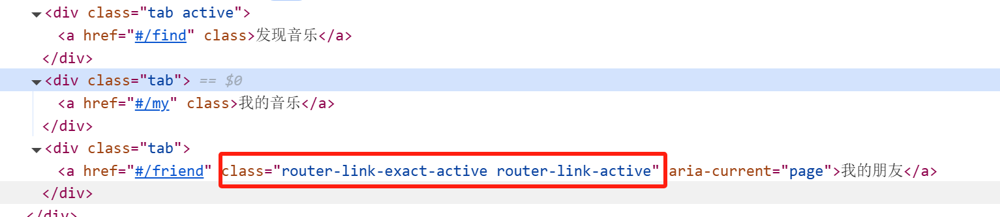

当前点击的`tab`，其会默认添加两个类名`router-link-exact-active`和` router-link-active`

```vue
<template>
  <div>
    <div class="tab-container">
      <!-- <div class="tab active"><a href="#/find">发现音乐</a></div>
      <div class="tab"><a href="#/my">我的音乐</a></div>
      <div class="tab"><a href="#/friend">朋友</a></div> -->
      <div class="tab active">
        <router-link to="/find">发现音乐</router-link>
      </div>
      <div class="tab"><router-link to="/my">我的音乐</router-link></div>
      <div class="tab"><router-link to="/friend">我的朋友</router-link></div>
    </div>
    <div class="tab-content">
      <router-view></router-view>
    </div>
  </div>
</template>

<script>
export default {};
</script>

<style>
.tab-container {
  display: flex;
  background-color: #333;
  width: 60%;
  margin: 30px auto;
}
.tab {
  flex: 1;
  padding: 10px;
  text-align: center;
  color: white;
  cursor: pointer;
}
.active {
  background-color: #444;
}
a {
  all: unset;
}
.tab-content {
  width: 60%;
  font-size: 50px;
  font-weight: 700;
  color: red;
  margin: 20px auto;
  text-align: center;
}
.router-link-active {
  background-color: rebeccapurple;
}
</style>
```

#### 声明式导航--两个类名

`router-link`会自动给当前导航元素添加两个高亮类名`router-link-exact-active`和` router-link-active`，那么这两个类名有什么区别？

- `router-link-active` 模糊匹配，用的比较多
  - `to=/my`可以匹配`/my`、`/my/a`、`/my/b`...
  - 即如果访问的链接为`/my/a`，则`/my`对应的导航栏也会高亮
- `router-link-exact-active` 精确匹配
  - `to=/my`仅仅可以匹配`/my`

**自定义高亮类名**

`router-link`自动添加的两个高亮类名比较长，如果我们希望能够定义类名怎么办？

可以在创建路由对象时，重新指定这两个类名的名称

```vue
const router = new VueRouter({
	routes:[],
	linkActiveClass:"类名",
	linkExactActiveClass:"类名"
})
```


#### 声明式导航--跳转传参

在跳转路由时，进行传值

##### 查询参数传参

**语法格式**

`to="/path?参数名1=值1&参数名2=值2"`

**对应页面组件接收传递过来的值**

`$route.query.参数名`

**实例**

`src/router/index.js`

```js
import VueRouter from "vue-router";
import Vue from "vue";

Vue.use(VueRouter)

import SearchPage from "@/views/SearchPage.vue";
const router = new VueRouter({
  routes: [
    { path: "/search", component: SearchPage }
  ]
})

export default router
```

`main.js`

```js
import Vue from 'vue'
import App from './App.vue'

Vue.config.productionTip = false

import router from '@/router/index.js'
new Vue({
  render: h => h(App),
  router
}).$mount('#app')

```

`App.vue`

```vue
<template>
  <div>
    <div class="header">
      <div class="logo">
        
        <span>黑马程序员</span>
      </div>
    </div>

    <div class="search-bar">
      <input type="text" placeholder="请输入搜索内容" />
      <input type="submit" value="搜索一下" />
    </div>

    <div class="hot-search">
      热门搜索：
      <router-link to="/search?words=黑马程序员">黑马程序员</router-link>
      <router-link to="/search?words=前端培训">前端培训</router-link>
      <router-link to="/search?words=如何成为前端大牛"
        >如何成为前端大牛</router-link
      >
    </div>
    <div class="content">
      <router-view></router-view>
    </div>
  </div>
</template>

<script>
export default {};
</script>

<style>
body {
  font-family: Arial, sans-serif;
  width: 60%;
  margin: 10px auto;
}
.header {
  text-align: center;
  margin-top: 20px;
}
.logo {
  display: inline-block;
  font-size: 24px;
  font-weight: bold;
  color: #333;
}
.search-bar {
  text-align: center;
  margin: 20px 0;
}
.search-bar input[type="text"] {
  width: 60%;
  padding: 10px;
  font-size: 16px;
}
.search-bar input[type="submit"] {
  padding: 10px 20px;
  font-size: 16px;
  background-color: #d9534f;
  color: white;
  border: none;
  cursor: pointer;
}
.hot-search {
  text-align: center;
  margin-bottom: 20px;
}
.hot-search a {
  margin: 0 5px;
  color: #d9534f;
  text-decoration: none;
  border: 1px solid #d9534f;
  padding: 5px 10px;
  border-radius: 5px;
}
.content {
  margin: 30px auto;
  width: 40%;
  text-align: center;
}
</style>
```

`SearchPage.vue`

```vue
<template>
  <div>
    <h2>当前为所有总页面</h2>
    <p>搜索的关键字:{{ $route.query.words }}</p>
  </div>
</template>

<script>
export default {};
</script>

<style>
</style>
```

##### 动态路由传参

**配置动态路由**

```vue
const router = new VueRouter({
	routes:[
		{path:"/xxx/:参数名"}
	]
})
```

**配置导航链接**

`to="/path/参数值"`

**对应页面组件接收传递过来的值**

`$route.params.参数名`

注意：`path:"/xxx/:参数名"`这种路由配置必须要传递对应的参数，如果不传参数，无法匹配，如果希望不传参数也能匹配，则可以加个可选符`?`，`path:/xxx/:参数名?`

**实例**

`src/router/index.js`

```js
import VueRouter from "vue-router";
import Vue from "vue";

Vue.use(VueRouter)

import SearchPage from "@/views/SearchPage.vue";
const router = new VueRouter({
  routes: [
    { path: "/search/:words", component: SearchPage }
  ]
})

export default router
```

`main.js`

```vue
import Vue from 'vue'
import App from './App.vue'

Vue.config.productionTip = false

import router from '@/router/index.js'
new Vue({
  render: h => h(App),
  router
}).$mount('#app')
```

`App.vue`

```vue
<template>
  <div>
    <div class="header">
      <div class="logo">
        
        <span>黑马程序员</span>
      </div>
    </div>

    <div class="search-bar">
      <input type="text" placeholder="请输入搜索内容" />
      <input type="submit" value="搜索一下" />
    </div>

    <div class="hot-search">
      热门搜索：
      <router-link to="/search/黑马程序员">黑马程序员</router-link>
      <router-link to="/search/前端培训">前端培训</router-link>
      <router-link to="/search/如何成为前端大牛">如何成为前端大牛</router-link>
    </div>
    <div class="content">
      <router-view></router-view>
    </div>
  </div>
</template>

<script>
export default {};
</script>

<style>
body {
  font-family: Arial, sans-serif;
  width: 60%;
  margin: 10px auto;
}
.header {
  text-align: center;
  margin-top: 20px;
}
.logo {
  display: inline-block;
  font-size: 24px;
  font-weight: bold;
  color: #333;
}
.search-bar {
  text-align: center;
  margin: 20px 0;
}
.search-bar input[type="text"] {
  width: 60%;
  padding: 10px;
  font-size: 16px;
}
.search-bar input[type="submit"] {
  padding: 10px 20px;
  font-size: 16px;
  background-color: #d9534f;
  color: white;
  border: none;
  cursor: pointer;
}
.hot-search {
  text-align: center;
  margin-bottom: 20px;
}
.hot-search a {
  margin: 0 5px;
  color: #d9534f;
  text-decoration: none;
  border: 1px solid #d9534f;
  padding: 5px 10px;
  border-radius: 5px;
}
.content {
  margin: 30px auto;
  width: 40%;
  text-align: center;
}
</style>
```

`SearchPage.vue`

```vue
<template>
  <div>
    <h2>当前为所有总页面</h2>
    <p>搜索的关键字:{{ $route.params.words }}</p>
  </div>
</template>

<script>
export default {};
</script>

<style>
</style>
```

##### 查询参数传参 vs 动态路由传参

- 查询参数传参比较适合传多个参数
- 动态路由传参优雅简洁，适合传单个参数

### 路由重定向

重定向：匹配到某一个路径之后，强制跳转到另一个路径

语法：`{path:匹配路径,redirect:重定向到的路径}`

### Vue路由--404

当路径找不到匹配时，给一个提示页面

语法：配在路由最后，`{path:"*"（任意路径）}`,前面不匹配就命中最后这个

### Vue路由--模式设置

背景：路由的路径看起来不自然，有`#`，能否切换成真正的路径形式

- hash路由(Vue默认)，例如`http://localhost:8080/#/home`
- history路由(常用),例如`http:localhost:8080/home`

语法：

```vue
const router = new VueRouter({
	routes,
	mode:"history"
})
```


### 编程式导航

#### 基本跳转

点击按钮如何实现页面的跳转，比如场景：输入关键词，点击搜索按钮；点击登录按钮

编程式导航：用JS代码来进行跳转

常见两种实现方式：

- path路径跳转
- name命名路由跳转

##### path路径跳转

**语法**

```vue
this.$router.push("路由路径")
或者完整写法
this.$router.push({
	path:"路由路径"
})
```

**实例**

`App.vue`

```vue
<template>
  <div>
    <div class="header">
      <div class="logo">
        
        <span>黑马程序员</span>
      </div>
    </div>

    <div class="search-bar">
      <input type="text" placeholder="请输入搜索内容" v-model="queryWord" />
      <input type="submit" value="搜索一下" @click="search" />
    </div>

    <div class="hot-search">
      热门搜索：
      <router-link to="/search/黑马程序员">黑马程序员</router-link>
      <router-link to="/search/前端培训">前端培训</router-link>
      <router-link to="/search/如何成为前端大牛">如何成为前端大牛</router-link>
    </div>
    <div class="content">
      <router-view></router-view>
    </div>
  </div>
</template>

<script>
export default {
  data() {
    return {
      queryWord: "",
    };
  },
  methods: {
    search() {
      this.$router.push(`/search/${this.queryWord}`);
    },
  },
};
</script>

<style>
body {
  font-family: Arial, sans-serif;
  width: 60%;
  margin: 10px auto;
}
.header {
  text-align: center;
  margin-top: 20px;
}
.logo {
  display: inline-block;
  font-size: 24px;
  font-weight: bold;
  color: #333;
}
.search-bar {
  text-align: center;
  margin: 20px 0;
}
.search-bar input[type="text"] {
  width: 60%;
  padding: 10px;
  font-size: 16px;
}
.search-bar input[type="submit"] {
  padding: 10px 20px;
  font-size: 16px;
  background-color: #d9534f;
  color: white;
  border: none;
  cursor: pointer;
}
.hot-search {
  text-align: center;
  margin-bottom: 20px;
}
.hot-search a {
  margin: 0 5px;
  color: #d9534f;
  text-decoration: none;
  border: 1px solid #d9534f;
  padding: 5px 10px;
  border-radius: 5px;
}
.content {
  margin: 30px auto;
  width: 40%;
  text-align: center;
}
</style>
```

##### name命名路由跳转

该方式适用于path路径长的场景

**语法**

- 配置路由时，给路由添加名字

```vue
{name:"路由名",path:"路径",component:"对应的组件名称"}
```

- 路由跳转

```vue
this.$router.push({
	name:路由名
})
```


#### 编程式导航--路由传参

背景：点击搜索按钮，跳转时传参如何实现？

##### path路径跳转传参

###### 查询参数传参

```vue
this.$router.push("路径?参数名1=参数值1&参数名2=参数值2")
或者完整的写法
this.$router.push({
	path:"路径",
	query:{
		参数名1:参数值1,
		参数名2:参数值2
	}
})
```

对应页面接收参数：`$route.query.参数名`

###### 动态路由传参

```vue
this.$router.push("/路径/参数值")
或者完整写法
this.$router.push("/路径/参数值")
```

对应页面接收参数：`$route.params.参数名`

##### name命名路由跳转传参

###### 查询参数传参

```vue
this.$router.push({
	name:"路由名字",
	query:{
		参数名1:"参数值1",
		参数名2:"参数值2"
	}
})
```

**动态路由传参**

```vue
this.$router.push({
	name:"路由名字",
	params:{
		参数名:"参数值"
	}
})
```


### 嵌套路由

在一级路由里面嵌套二级路由

**语法**

```vue
const router = new VueRouter({
	routes:[
		{
			path:"一级路由路径",
			component:对应的组件,
			children:[//在children中配置二级路由
				{path:二级路由路径,component:对应的组件}
			]
		}
	]
})
```

注意：为了能够展示二级路由页面，在一级路由页面中也要配置路由出口`<router-view></router-view>`

### 组件缓存 keep-alive

在列表页，点击一个进入对应详情页，点击返回，混动条自动切换到了最开头的位置，原来点击的位置看不到了，这样用户体验不好

**背景：**从面经点到详情页，又点返回，数据重新加载了，但是希望能够回到原来的位置

**原因：**路由跳转之后，组件被销毁了，返回回来的组件又被重建了，所以数据重新被加载了

**解决方案：**利用keep-alive将组件缓存下来

#### keep-alive

`keep-alive`是`Vue`内置组件，当它包裹动态组件时，会缓存不活动的组件实例，而不是销毁它们

`keep-alive`时一个抽象组件，它自身不会渲染成一个`DOM`元素，也不会出现在父组件链中

**keep-alive优势**

- 在组件切换过程中，把切换出去的组件保留在内存中，防止重复渲染dom
- 减少加载时间以及性能消耗，提高用户体验性

**语法**

```vue
<keep-alive>
	<router-view></router-view>
</keep-alive>
```

`keep-alive`默认会缓存所有的组件，但是可以通过配置属性值来对其进行控制

**keep-alive三个属性**

- include：组件名数组，只有匹配的组件才会被缓存
- exclude：组件名数组，任何匹配的组件都不会被缓存
- max：最多可以缓存多少组件实例

```vue
<keep-alive :include="['组件名']">
	<router-view></router-view>
</keep-alive>
```


**补充**

`keep-alive`缓存的组件会增加两个生命周期钩子函数

- `actived`：激活时，组件被看到时会被触发
- `deactived`：失活时，离开页面组件看不见时触发

因为组件一旦被缓存，就不会执行组件的`created`、`mounted`和`destroyed`函数


## 常规项目实现基本步骤

1. 配置路由
2. 实现具体页面的功能


## 自定义创建项目

基于`VueCli`自定义创建项目架子，前面使用路由时，需要手动导包、注册、创建路由实例、注入vue对象，步骤比较繁琐

本节介绍如何自定义创建项目架子

**步骤**

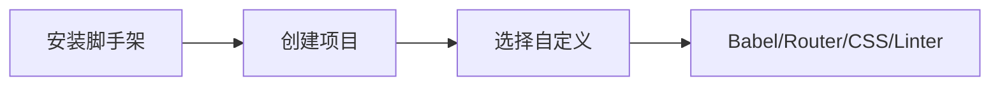

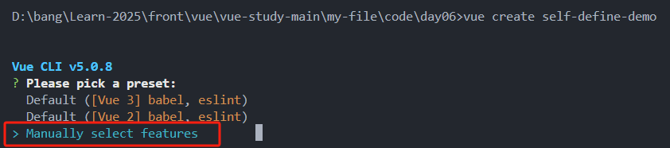

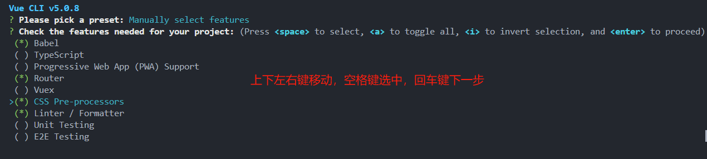

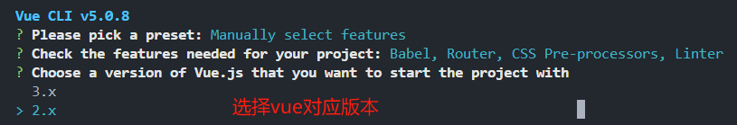

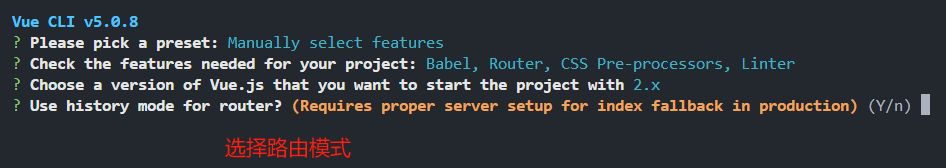

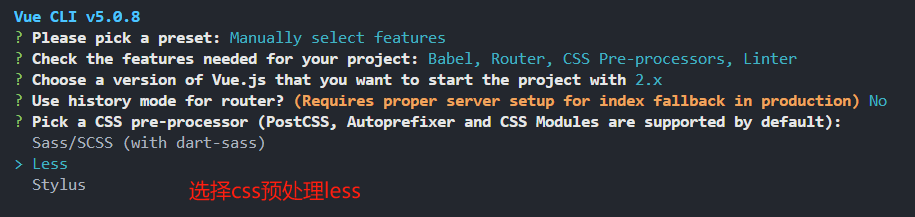

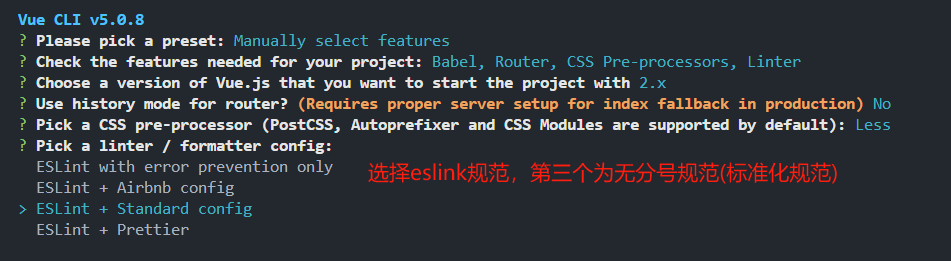

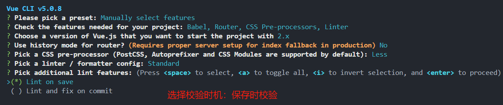

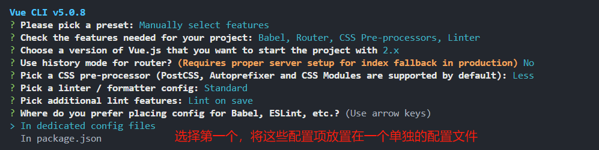


## ESlint代码规范

### 代码规范

代码规范即一套写代码的约定规则，例如赋值符号的左右是否需要空格，一句话结束是否需要加`;`

Vue代码常用的规范：[JavaScript Standard Style规范](https://standardjs.com/rules-zhcn)

### 代码规范错误

如果编写的代码不符合standard的要求，`ESlint`会进行错误提示

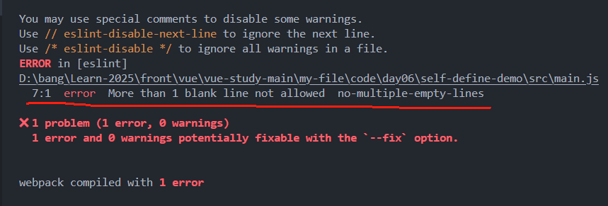

### 解决代码规范错误

#### 手动修正

根据错误提示一项一项手动去修改纠正

如果不认识命令行中的语法报错的含义，可以根据错误代码去 [ESlint规则表](zh-hans.eslint.org/docs/latest/rules/)查找具体含义

#### 自动修正

基于`vscode`插件`ESLint`高亮错误，并通过配置自动帮助我们修复错误

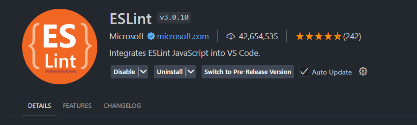

添加配置，使得文件保存时，`ESlint`自动帮我们修复错误

```json
//当保存时，eslint自动帮助我们修复错误
"editor.codeActionsOnSave": {
    "source.fixAll": true
},
//保存代码，不自动格式化
"editor.formatOnSave": false
```

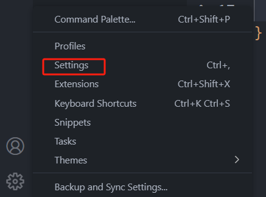

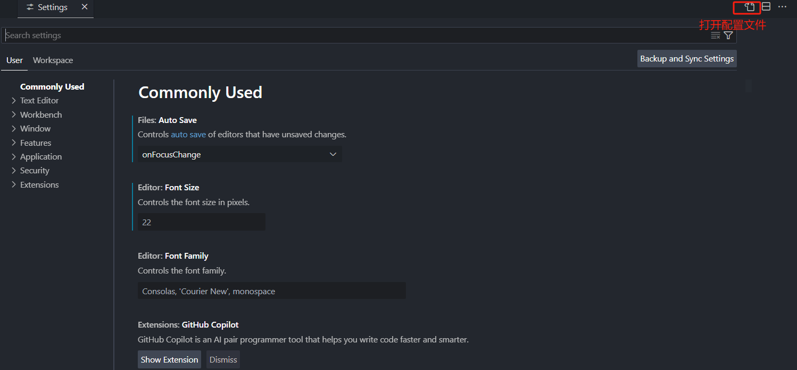

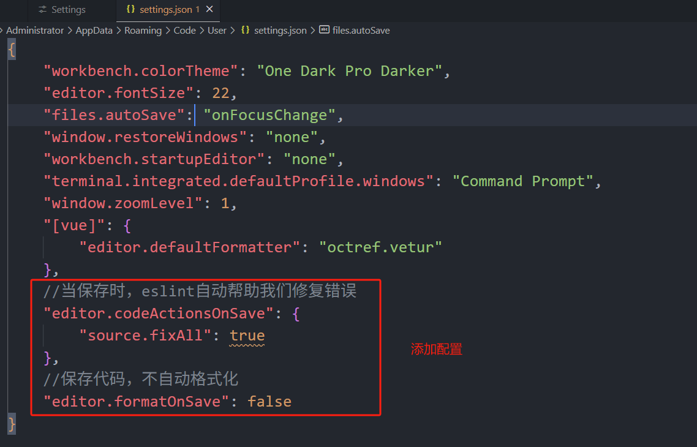


