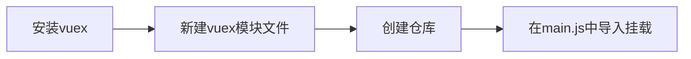
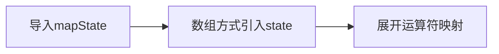

---

---

# Vuex

## vuex概述

[vuex](https://vuex.vuejs.org/zh/)是一个`vue`的状态管理工具，所谓的状态就是数据，它可以帮助我们管理`vue`通用的数据（多组件共享的数据）

**vuex的常用场景**

- 某个数据在多个组件来使用，比如个人信息
- 多个组件共同维护一份数据，比如购物车数据

**vuex的优势**

- 数据集中化管理，共同维护一份数据
- 数据响应式变化
- 操作简洁，vuex提供了一些辅助函数


## vuex使用步骤



**安装vuex**

```shell
npm i vuex@3
```

**新建vuex模块文件**

新建`src/store/index.js`专门存放`vuex`

```vue
import Vue from 'vue'
import Vuex from 'vuex'

// 插件安装
Vue.use(Vuex)

// 创建仓库
const store = new Vuex.Store()

// 导出
export default store
```

**创建仓库**

```vue
Vue.use(Vuex)
new Vuex.Store()
```

**main.js导入挂载**

在`main.js`中导入仓库，挂载到`Vue`实例上

```vue
import Vue from 'vue'
import App from './App.vue'
import store from '@/store/index'

Vue.config.productionTip = false

new Vue({
  render: h => h(App),
  store
}).$mount('#app')
```

**获取仓库**

```vue
//其他组件中均可获取仓库对象
this.$store
```

**注意：**后续可以在利用`vueCli`创建项目时，勾选`vuex`选项，其会自动完成上述步骤


## state

### 提供数据

`State`提供唯一的公共数据源，所有共享的数据都要统一放到`Store`中的`State`中存储，在`State`对象中可以添加我们要共享的数据

```vue
cosnt store = new Vuex.Store({
	//state中是所有组件共享的数据
	state:{
		数据名:数据值
	}
})
```


### 获取数据

#### 方案一：通过store直接访问

```vue
//模板中获取数据
{{ $store.state.数据名 }}
//组件逻辑中
this.$store.state.数据名
//JS模块中
store.state.数据名
```


#### 方案二：通过辅助函数

利用`mapState`辅助函数，帮助我们把`store`中的数据自动映射到组件的计算属性中



**导入mapState**

```vue
import{ mapState } from 'Vuex'
```

**数组方式引入state**

```vue
mapState(['数据名'])
```

**展开运算符映射**

```vue
computed:{
	...mapState(["数据名"])//mapState(["数据名"])是一个对象,...表示将对象展开
}
```

**其他组件访问数据**

```vue
{{ 数据名 }}
```


## mutations

### mutations基本用法

`vuex`同样遵循单向数据流，组件中不能直接修改仓库中的数据，因为一旦项目规模比较大，后续数据发生变化，无法清晰确定是哪个组件操作引起的数据变化

`state`数据的修改只能通过`mutations`的操作流程来进行

**语法**

- 定义`mutations`对象，对象中存放修改`state`的方法

```vue
const store = new Vuex.Store({
	state:{
		数据名:数据值
	},
	mutations:{
		修改数据的逻辑函数，函数的第一个参数是当前store的state属性
	}
})
```

- 组件中提交调用`mutations`

```vue
this.$store.commit("修改逻辑函数名")
```


### mutations传参

提交`mutations`时是可以传递参数的`this.$store.commit("逻辑函数名",参数)`

**注意：**`mutations`参数有且只能有一个，如果需要多个参数，则包装成一个对象进行传递


### 辅助函数mapMutations

`mapMutations`是把位于`mutations`中的方法提取出来，映射到组件`methods`中

**语法**

```vue
import {mapMutations} from 'vuex'

methods:{
	...mapMutations(["逻辑函数名"])
}
```

在使用的地方直接使用:`{{ 逻辑函数名 }}`


## actions

`actions`用于处理异步操作，比如指定一秒钟之后，修改某个数据的值，而`mutations`必须是同步的

**实例：**一秒钟之后，修改`state`的`count`为666

```vue
//提供action方法
actions:{
	setAsyncCount(contex,num){
		setTimeOut(()=>{//这里用setTimeOut模拟异步，实际场景中一般是发送请求
			contex.commit("changeCount",num)
		},1000)
	}
},
mutations:{
	changeCount(state,newCount){
		state.count = newCount
	}
}
```

组件页面中的调用

```vue
this.$store.dispatch('setAsyncCount',666)
```


### 辅助函数mapActions

辅助函数`mapActions`是把位于`actions`中的方法提取出来，映射到`methods`中

```vue
methods:{
	...mapActions(["函数名"])
}
```


## getters

### 定义getters

除了`state`之外，有时我们需要从`state`中派生出一些状态，这些状态是依赖`state`的，此时就会用到`getters`

**实例：**state中定义了一个list，是1-10的数组，现在需求为在组件中，显示所有大于5的数据

```vue
state:{
	list:[1,2,3,4,5,6,7,8,9,10]
}
```

```vue
getters:{
	//getters函数第一个参数是state，所有的getters函数都必须要有返回值
	filterList(state){
		return state.list.filter((num)=>num>5)
	}
}
```

### **访问getters**

#### **方法1：通过store访问getters**

```vue
{{ $store.getters.filterList }}
```

#### 方法2：通过辅助函数mapGetters映射

```vue
computed:{
	...mapGetters(["filterList"])
}
```

获取数据：`{{ filterList }}`


## modules

### 基本语法

由于`vuex`使用单一状态树，应用的所有状态（数据）会集中到一个比较大的对象，当应用变得非常复杂时，`store`对象就会变得相当臃肿，`vuex`就会变得越来越难以维护，此时就需要进行模块拆分，根据具体项目的业务，对状态按模块进行划分

**实例语法：将用户信息模块单独划分**

新建文件`src/store/module/user.js`

```vue
const state = {
	userInfo:{
		xxx:xx
	}
}
const mutations = {}
const actions = {}
const getters = {}
export default{
	state,
	mutations,
	actions,
	getters
}
```

在`src/stote/index.js`中导入对应模块

```vue
import user from './moudle/user'
const store = new Vuex.Store({
	modules:{
		user
	}
})
```


### 访问模块中的state

尽管已经分模块了，但其实子模块的状态，还是会挂到根级别的`state`中，属性名就是模块名

#### 方法1：通过store来访问

```vue
$store.state.模块名.数据名
```

#### 方法2：通过mapState来映射

子模块的映射需要开启命名空间，即在子模块导出的地方添加一项配置
```vue
export default{
	namespaced: true,
	state,
	mutations,
	actions,
	getters
}
```

子模块的映射语法
```vue
mapState("模块名",["数据名"])
```


### 访问模块中的getters

#### 直接通过模块名访问

```vue
$store.getters["模块名/数据名"]
```

#### 通过mapGetters映射

同样需要开启命名空间

子模块的映射语法

```vue
mapGetters("模块名",["数据名"])
```


### 调用模块中的`mutations`

**注意：**默认模块中的`mutations`和`actions`会被挂载到全局，需要开启命名空间，才会挂载到子模块

#### 通过store调用子模块mutation

```vue
$store.commit('模块名/mutation函数名',额外参数)
```

#### 通过mapMutations进行映射

```vue
mapMutations("模块名",["mutation函数名“])
```


### 调用子模块中的action

同样需要预先开启命名空间

#### 通过store调用子模块中的action

```vue
$store.dispatch("模块名/action里面的函数名",额外参数)
```

#### 通过mapActions映射

子模块的映射语法

```vue
mapActions("模块名",["action函数名"])
```


